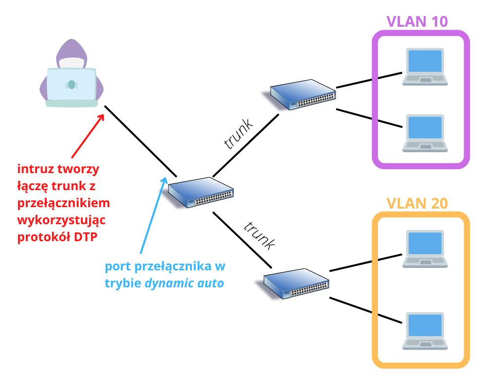
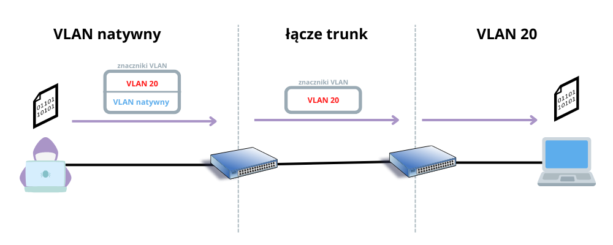
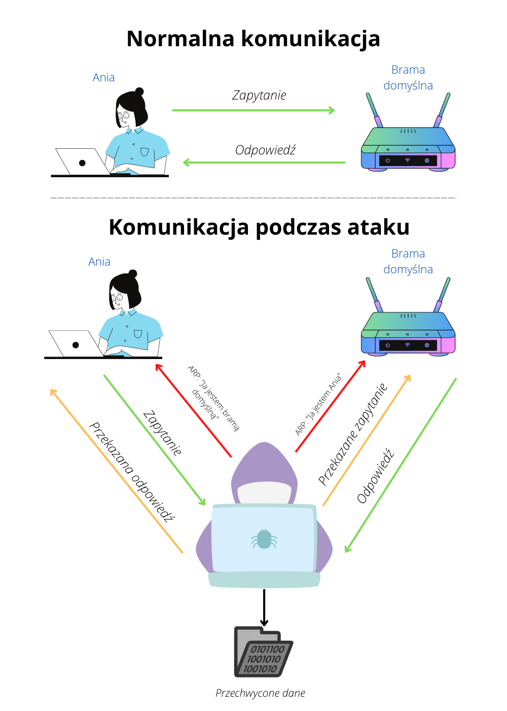
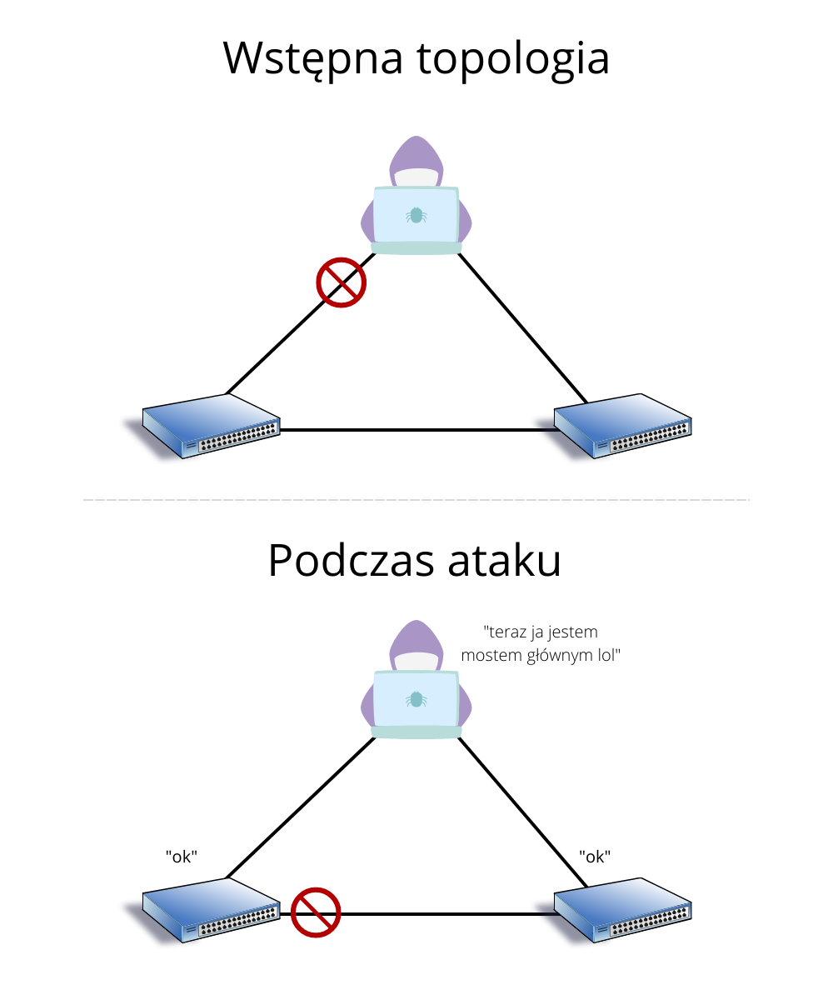

# Bezpieczeństwo sieci LAN

**Przydatne linki**

- [dr inż. Maciej Sobieraj - Rozdział 6: Sieci VLAN](http://maciej.sobieraj.pracownik.put.poznan.pl/W04_TAPS.pdf)
- [dr inż. Maciej Sobieraj - Rozdział 2: Wprowadzenie do sieci przełączanych](http://maciej.sobieraj.pracownik.put.poznan.pl/W05_TAPS.pdf)
- [dr inż. Maciej Sobieraj - Wykład 6: Uwierzytelnianie, autoryzacja i konta użytkowników](http://maciej.sobieraj.pracownik.put.poznan.pl/W06_bsi.pdf)
- [NetworkChuck - you NEED to learn Port Security…….RIGHT NOW!! // FREE CCNA // EP 14](https://www.youtube.com/watch?v=0W4JZIWtjLQ)
- [NetworkChuck - how Hackers SNiFF (capture) network traffic // MiTM attack](https://www.youtube.com/watch?v=-rSqbgI7oZM)
- [David Bombal - iPhone and Android WiFi Man-in-the-middle attack // PYTHON Scapy scripts for attacking networks](https://www.youtube.com/watch?v=O1jpck31Ask)
- [David Bombal - VLANs: Am I a joke to you? // Python VLAN hacking.](https://www.youtube.com/watch?v=u5cp_hcwq2c)
- [David Bombal - They said this doesn't work 🤣 Hacking networks with VLAN hopping and Python](https://www.youtube.com/watch?v=SiFyhipl57A)
- [David Bombal - Dynamic ARP Inspection: Stop Kali Linux ARP poisoning attacks](https://www.youtube.com/watch?v=uKhySSs08tk)
- [David Bombal - DHCP Snooping: Stop Kali DHCP Hacks and MITM](https://www.youtube.com/watch?v=S6KI6VsvDuU)
- [David Bombal - Hacking Spanning Tree with Python, Scapy and Kali Linux (Ep 2) // STP Root Bridge attack! 😀](https://www.youtube.com/watch?v=Ay6fVYpYlkQ)
- [David Bombal - DHCP Starvation (DoS) Attack // Python Scapy Red Team Script](https://www.youtube.com/watch?v=VW0szfPHeo0)
- [David Bombal - Scapy [GitHub]](https://github.com/davidbombal/scapy)

**Spis treści**
- [Bezpieczeństwo sieci LAN](#bezpieczeństwo-sieci-lan)
  - [Ataki sieciowe](#ataki-sieciowe)
  - [Urządzenia zabezpieczające sieć](#urządzenia-zabezpieczające-sieć)
    - [Router z obsługą VPN](#router-z-obsługą-vpn)
    - [Zapora sieciowa nowej generacji (NGFW)](#zapora-sieciowa-nowej-generacji-ngfw)
    - [Urządzenie kontroli dostępu do sieci (NAC)](#urządzenie-kontroli-dostępu-do-sieci-nac)
  - [Ochrona węzłów końcowych](#ochrona-węzłów-końcowych)
    - [Oprogramowanie antywirusowe](#oprogramowanie-antywirusowe)
    - [Cisco Secure Email](#cisco-secure-email)
    - [Cisco Secure Web Appliance](#cisco-secure-web-appliance)
  - [Kontrola dostępu](#kontrola-dostępu)
    - [Lokalne hasło](#lokalne-hasło)
    - [AAA](#aaa)
      - [Uwierzytelnianie](#uwierzytelnianie)
      - [Autoryzacja](#autoryzacja)
      - [Ewidencjonowanie](#ewidencjonowanie)
    - [IEEE 802.1X](#ieee-8021x)
  - [Ataki i zagrożenia w warstwie 2](#ataki-i-zagrożenia-w-warstwie-2)
    - [MAC flooding](#mac-flooding)
    - [Fałszowanie adresów](#fałszowanie-adresów)
    - [VLAN hopping](#vlan-hopping)
      - [Wykorzystanie protokołu DTP](#wykorzystanie-protokołu-dtp)
      - [Podwójne znakowanie VLAN](#podwójne-znakowanie-vlan)
    - [Ataki na DHCP](#ataki-na-dhcp)
      - [Głodzenie DHCP](#głodzenie-dhcp)
      - [Fałszowanie DHCP](#fałszowanie-dhcp)
    - [Atak na ARP](#atak-na-arp)
    - [Ataki na STP](#ataki-na-stp)
    - [Rekonesans z użyciem CDP](#rekonesans-z-użyciem-cdp)
  - [Ograniczanie ataków w warstwie 2](#ograniczanie-ataków-w-warstwie-2)
  - [Konfigurowanie zabezpieczeń przełącznika](#konfigurowanie-zabezpieczeń-przełącznika)
    - [Port Security](#port-security)
    - [Ograniczanie ataków na VLAN](#ograniczanie-ataków-na-vlan)
    - [DHCP Snooping](#dhcp-snooping)
    - [Dynamic ARP Inspection](#dynamic-arp-inspection)
    - [Ograniczanie ataków na STP](#ograniczanie-ataków-na-stp)

## Ataki sieciowe

Istnieją różne rodzaje ataków różniących się celami i sposobami ich przeprowadzania. Najczęściej można się spotkać z takimi elementami ataku jak:

- **odmowa usługi** - ataki typu DoS (*denial of service*) polegają na uniemożliwieniu lub utrudnieniu dostępu do zasobów sieciowych normalnym użytkownikom. Atak ten może przyjmować formę ataku typu DDoS (*distributed denial of service*), który polega na przytłoczeniu celu ruchem generowanym z wielu urządzeń jednocześnie (np. poprzez *botnet*)
- **naruszenie danych** - ten element występuje kiedy poufne informacje użytkowników lub organizacji dostaną się w niepowołane ręce, zostaną przechwycone i/lub zmodyfikowane przez przestępców
- **złośliwe oprogramowanie** - *malware* (*malicious software*) to niepożądane oprogramowanie zaprojektowane w celu spowodowania szkód w systemie lub przechwyceniu poufnych danych, takich jak loginy i hasła. Może przybierać różne formy, przykładowo:
  - **spyware** - oprogramowanie szpiegujące mające na celu przechwycenie poufnych informacji, np. loginów i haseł. Może przeglądać pliki na urządzeniu, przechwytywać naciśnięte klawisze czy wykonywać zrzuty ekranu
  - **RAT** (*remote access trojan*) - daje atakującemu dostęp (lub nawet pełną kontrolę) nad zainfekowanym systemem. Przestępca może wykonywać na urządzeniu polecenia systemowe, zmieniać jego konfiguracje lub zainstalować kolejne złośliwe oprogramowanie
  - **ransomware** - rodzaj malware, który uniemożliwia użytkownikowi dostęp do jego plików poprzez ich zaszyfrowanie. Atakujący żąda od ofiary zapłaty (okupu, najczęściej w kryptowalucie, np. Bitcoin) w zamian za odszyfrowanie jej plików. Przykładem takiego programu jest [WannaCry](https://www.youtube.com/watch?v=cFGAAeTTmXM)


## Urządzenia zabezpieczające sieć

### Router z obsługą VPN

Technologia VPN zapewnia bezpieczny zdalny dostęp do sieci osobom znajdującym się poza jej obrębem. Ruch jest tunelowany i szyfrowany, dzięki czemu może być bezpiecznie przenoszony przez sieci publiczne takie jak Internet.

### Zapora sieciowa nowej generacji (NGFW)

Zapora ogniowa nowej generacji (*next generation firewall*) oferuje funkcje takie jak:

- stanowa inspekcja pakietów
- kontrola aplikacji
- system zapogiegania włamaniom nowej generacji (NGIPS, *next generation intrusion prevention system*)
- ochrona przed złośliwym oprogramowaniem
- filtrowanie adresów URL

### Urządzenie kontroli dostępu do sieci (NAC)

Urządzenia kontroli dostępu do sieci (*network access control*) mogą zarządzać zasadami dostępu dla wielu użytkowników i różnych typów urządzeń. Obejmują usługi:

- uwierzytelnienia (*kto* może uzyskać dostęp)
- autoryzacji (*do czego* może uzyskać dostęp)
- ewidencjonowania (co rzeczywiście zrobił)

Przykładem urządzenia NAC jest [Cisco Identity Services Engine](https://www.cisco.com/site/us/en/products/security/identity-services-engine/index.html).

## Ochrona węzłów końcowych

Zagrożenia mogą pochodzić nie tylko z zewnątrz, ale również z wnętrza sieci. Co jeśli ktoś (obcy lub znajomy) przyniesie i podłączy do naszej sieci zainfekowane urządzenie, np. laptop? Malware może zacząć *panoszyć się* po całej sieci próbując zarazić więcej urządzeń wyrządzając coraz więcej szkód i kradnąc poufne informacje. Dlatego, oprócz ochrony dostępu do sieci, ważna jest ochrona punktów końcowych.

### Oprogramowanie antywirusowe

Antywirus to oprogramowanie *must-have*. Skanuje pliki, monitoruje procesy czy nawet połączenia sieciowe (w ramach zapory ogniowej opartej na hoście) w poszukiwaniu złośliwego oprogramowania, takiego jak wirusy czy konie trojańskie.

Przykładami oprogramowania antywirusowego są: [Windows Defender](https://docs.microsoft.com/pl-pl/mem/intune/user-help/turn-on-defender-windows), [Cisco Advanced Malware Protection](https://www.cisco.com/c/pl_pl/products/security/advanced-malware-protection/index.html), [ESET NOD32 Antivirus](https://www.eset.com/pl/home/antivirus/), [Bitdefender](https://bitdefender.pl/), [Kaspersky](https://www.kaspersky.com.pl/), [McAfee](https://www.mcafee.com/pl-pl/index.html), [Avast](https://www.avast.com/pl-pl/index#pc), czy [ClamAV](https://www.clamav.net/), antywirus *open-source*.

### Cisco Secure Email

Poczta elektroniczna może być wykorzystana w nieetycznych celach jako próba uzyskania nieuprawnionego dostępu do czyichś zasobów. Oprócz zwyczajnego spamu, wiadomość e-mail może być atakiem socjotechnicznym znanym jako *phishing*. Taki mail może zawierać link przekierowujący do złośliwej strony lub załącznik zawierający malware.

[Cisco SE](https://www.cisco.com/site/us/en/products/security/secure-email/index.html) monitoruje protokoły e-mail i jest ciągle aktualizowane w czasie rzeczywistym z informacjami od [Cisco Talos](https://www.talosintelligence.com/), aby chronić pocztę elektroniczną.

Zapewnia takie funkcje jak:

- unieszkodliwianie malware
- odrzucanie wiadomości z podejrzanymi linkami
- blokowanie dostępu do zainfekowanych punktów
- blokowanie zagrożeń
- szyfrowanie wiadomości

### Cisco Secure Web Appliance

Wiele zagrożeń pochodzi z Internetu - złośliwe strony internetowe, malware.

[Cisco SWA](https://www.cisco.com/c/en/us/products/security/web-security-appliance/index.html) zapewnia kontrolę nad dostępem do Internetu. Może filtrować adresy URL na podstawie ich czarnej listy, skanowanć w poszukiwaniu malware, szyfrować ruch czy filtrować aplikacje.

## Kontrola dostępu

Kontrola dostępu jest bardzo istotna. Ważne jest umożliwienie uzyskania dostępu do określonych zasobów tylko uprawnionym użytkownikom.

### Lokalne hasło

Jest to najbardziej popularna forma uwierzytelnienia. Systemy operacyjne (Windows, Linux, macOS, Android, Cisco IOS) i wiele apliakacji webowych przechowuje hasła lokalnie w systemie. Tylko osoba znająca hasło może uzyskać dostęp do systemu.

### AAA

AAA jest bardziej kompleksowym rozwiązaniem. Konta użytkowników są przechowywane na serwerze AAA (np. [RADIUS](https://en.wikipedia.org/wiki/RADIUS) lub [TACACS](https://en.wikipedia.org/wiki/TACACS)) i operacje uwierzytelnienia (*authentication*), autoryzacji (*authorization*) i ewidencjonowania (*accounting*) są wykonywane w oparciu o komunikację z tym serwerem.

#### Uwierzytelnianie

Przykładowo, zabezpieczenie sieci Wi-Fi [WPA2 Enterprise](https://www.benchmark.pl/testy_i_recenzje/bezpieczne-sieci-wi-fi/strona/24027.html) wykorzystuje serwer RADIUS w celu uwierzytelnienia użytkowników zamiast współdzielonego hasła. Kiedy użytkownik próbuje połączyć się z siecią, podaje swój login i hasło. Następnie router konsultuje się z serwerem AAA w celu sprawdzania, czy podane dane są prawidłowe. Jeśli tak - zezwala użytkownikowi na dostęp do sieci.

#### Autoryzacja

Autoryzacja kontroluje to, co użytkownicy mogą robić w systemie, do czego mają dostęp a do czego nie. Serwer AAA utrzymuje zestaw reguł, które opisują uprawnienia użytkowników.

#### Ewidencjonowanie

Serwer AAA gromadzi dane użytkownika i tworzy dotyczące jego aktywności raporty. Może zbierać takie informacje jak czas rozpoczęcia i zakończenia sesji, wykonane polecenia itp. Te dane stanowią dowód, co użytkownik zrobił w systemie.

### IEEE 802.1X

Standard [IEEE 802.1X](https://standards.ieee.org/ieee/802.1X/7345/) to protokół kontroli dostępu oparty na portach urządzenia.

Gdy klient (*suplikant*) zostaje podłączony do portu przełącznika (*wystawcy uwierzytelnienia*), ten żąda od niego informacji identyfikacyjnych i kontaktuje się z *serwerem uwierzytelniającym* w celu weryfikacji klienta. Serwer decyduje, czy urządzenie jest upoważnione do dostępu do sieci czy nie.

## Ataki i zagrożenia w warstwie 2

Warstwa łącza danych modelu OSI jest najbardziej podatna na ataki. Co więcej, jeśli zagrożona jest warstwa druga, to zagrożone są również wszystkie warstwy powyżej.

W celu poprawy bezpieczeństwa należy:

 - używać z bezpiecznych wariantów protokołów takich jak [HTTPS (HTTP Secure)](https://en.wikipedia.org/wiki/HTTPS)
 - **nigdy** nie korzystać z [Telnet](https://en.wikipedia.org/wiki/Telnet#Security) do zdalnego dostępu, ponieważ nie szyfruje on ruchu, przez co hasła dostępu do takich urządzeń jak routery czy przełączniki mogą zostać przechwycone. Zamiast Telnetu powinno się używać [SSH](https://en.wikipedia.org/wiki/Secure_Shell)
 - zaimplementować wiele sieci VLAN, w tym osobną sieć VLAN dla zarządzania

### MAC flooding

Rozmiar tablicy MAC przełącznika jest ograniczony. W momencie gdy zostanie zapełniona, nowe odebrane ramki traktuje jako *nieznany unicast* i rozsyła przez wszystkie porty (należące do tej samej sieci VLAN) - innymi słowy, zachowuje się jak hub/koncentrator.

Intruz w sieci może *zalać* przełącznik fałszywymi adresami MAC przepełniając jego tablicę, co pozwoli mu przechwytywać dane z sieci.


Przykładowym narzędziem do przeprowadzenia takiego ataku jest [`macof`](https://linux.die.net/man/8/macof)

```
$ macof -i eth0 -n 1000
```

### Fałszowanie adresów

Fałszowanie adresów mam miejsce wtedy, gdy intruz używa adresu IP lub adresu MAC innego urządzenia (lub losowego adresu).

Gdy napastnik wyśle ramkę z adresem MAC ofiary, przełącznik zaktualizuje wpis w tablicy dla tego adresu MAC, przyporządkując mu numer portu, do którego podłączony jest napastnik i będzie omyłkowo wysyłać ramki do atakującego zamiast do ofiary.

### VLAN hopping

Zasadniczo, jeśli nie został skonfigurowany routing między sieciami VLAN, nie można komunikować się z urządzeniami w innych sieciach VLAN. Atak z przeskokami VLAN polega właśnie na uzyskaniu dostępu do urządzeń w innych sieciach VLAN, do których atakujący nie powinien mieć dostępu, bez wykorzystywania routingu w warstwie 3.

#### Wykorzystanie protokołu DTP

Jeśli port przełącznika, do którego podłączył się intruz, jest skonfigurowany w trybie **`dynamic auto`** lub **`dynamic desirable`**, atakujący może utworzyć z tym portem łącze *trunk*. W ten sposób będzie w stanie wysyłać i odbierać ruch z różnych sieci VLAN.



#### Podwójne znakowanie VLAN

Jeśli atakujący podłączy urządzenie do portu przełącznika należącego do sieci VLAN, która jest siecią VLAN natywną, może wykorzystać podwójne znakowanie VLAN, aby wysłać pakiet do innej sieci VLAN niż ta, w której się znajduje.

W tym celu tworzy ramkę która zawiera dwa znaczniki VLAN:

- zewnętrzny ze znacznikiem VLAN natywnego, do którego należy urządzenie intruza
- wewnętrzny ze znacznikiem VLAN, do którego należy urządzenie docelowe

Gdy taka ramka dociera do portu przełącznika, ten widzi, że jest przeznaczona dla VLAN natywnego, więc usuwa znacznik (zewnętrzny) VLAN, ponieważ natywny VLAN jest przeznaczony dla ruchu nieoznakowanego i przekazuje ramkę dalej. Kolejny przełącznik nie ma pojęcia, że odebrana ramka była przeznaczona dla VLAN natywnego i odczytuje znacznik (wewnętrzny) VLAN i wysyła ramkę do tej sieci VLAN. W końcu ramka trafia do urządzenia docelowego.



Przykładowe skrypty demonstrujące atak na sieci VLAN można znaleźć na [GitHubie Davida Bombala](https://github.com/davidbombal):

- [Tworzenie łącza `trunk` z przełącznikiem (DTP)](https://github.com/davidbombal/scapy/blob/main/dtp-form-a-trunk.py)
- [Wielokrotne znakowanie `802.1Q`](https://github.com/davidbombal/scapy/blob/main/vlan-hopping.py)

### Ataki na DHCP

#### Głodzenie DHCP

Atak [*DHCP Starvation*](https://www.cbtnuggets.com/blog/technology/networking/what-is-a-dhcp-starvation-attack) polega na przeprowadzeniu ataku DoS, poprzez zalanie serwera DHCP pakietami **DHCPDISCOVER** z fałszywymi adresami MAC. Serwer DHCP każdemu adresowi MAC zarezerwuje adres IP ze swojej puli. Atakujący będzie wysyłał fałszywe pakiety tak długo, aż adresy w puli serwera DHCP wyczerpią się (wszystkie zostaną zarezerwowane dla fałszywych adresów MAC), przez co użytkownicy nie będą mogli otrzymać adresów IP i tym samym zostaną pozbawieni dostępu do sieci.

Przykładowy skrypt demonstrujący ten typ ataku można odnaleźć na [GitHubie Davida Bombala](https://github.com/davidbombal) - [DHCP Exhaustion](https://github.com/davidbombal/scapy/blob/main/dhcp-exhaustion-basic.py)

#### Fałszowanie DHCP

[*DHCP Spoofing*](https://pentera.io/blog/dhcp-spoofing-101/) polega na podszyciu się przez atakującego pod serwer DHCP. Intruz konfiguruje swoje urządzenie jako serwer DHCP (*Rogue DHCP Server*) i wysyła oferty DHCP klientom w sieci. Podaje im fałszywe informacje, np. niewłaściwy serwer DNS lub inną bramę domyślną, dzięki czemu może doprowadzić do ataku typu [*man-in-the-middle*](https://plblog.kaspersky.com/co-to-jest-atak-man-in-the-middle/186/) przechwytując ruch ofiary lub przekierowując ją na fałszywe strony WWW.

### Atak na ARP

Atak [*ARP Spoofing*](https://www.imperva.com/learn/application-security/arp-spoofing/) lub inaczej [*ARP cache poiosning*](https://en.wikipedia.org/wiki/ARP_spoofing) polega na wysyłaniu *gratisowych* odpowiedzi ARP, z adresami IP ofiar i adresem MAC atakującego, co pozwala na przeprowadzenie ataku *man-in-the-middle*.

Przykładowo, do hosta ofiary wysyłamy wiadomość ARP *reply*, że jesteśmy bramą domyślną, a do bramy domyślnej, że jesteśmy hostem ofiary.



Popularnym narzędziem do przeprowadzania tego ataku jest [***Ettercap***](https://www.ettercap-project.org/), ale przykładowy skrypt demonstrujący atak zatruwania ARP można znaleźć na [GitHubie Davida Bombala](https://github.com/davidbombal) - [ARP Man-in-the-middle](https://github.com/davidbombal/red-python-scripts/blob/main/arp_mitm.py)

### Ataki na STP

Intruz może zmanipulować protokół STP w taki sposób, aby stać się *mostem głównym*. Aby to osiągnąć, atakujący wysyła pakiety BPDU wymuszając ponowne obliczanie drzewa rozpinającego i zmianę topologi. Ustawia swój priorytet na jak najniższy, aby jego urządzenie zostało wybrane na most główny, dzięki czemu może przechwytywać cały ruch z domeny przełączanej.



Przykładowy skrypt demonstrujący atak na STP z podszyciem się pod most główny również można znaleźć na [GitHubie Davida Bombala](https://github.com/davidbombal) - [Spanning Tree Root attack](https://github.com/davidbombal/scapy/blob/main/spanning-tree-root-attack.py)

### Rekonesans z użyciem CDP

## Ograniczanie ataków w warstwie 2

## Konfigurowanie zabezpieczeń przełącznika

### Port Security

### Ograniczanie ataków na VLAN

### DHCP Snooping

### Dynamic ARP Inspection

### Ograniczanie ataków na STP
