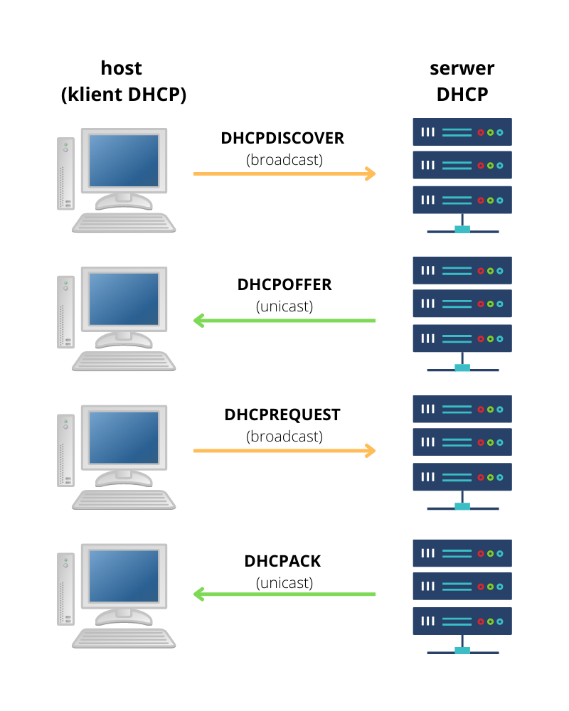
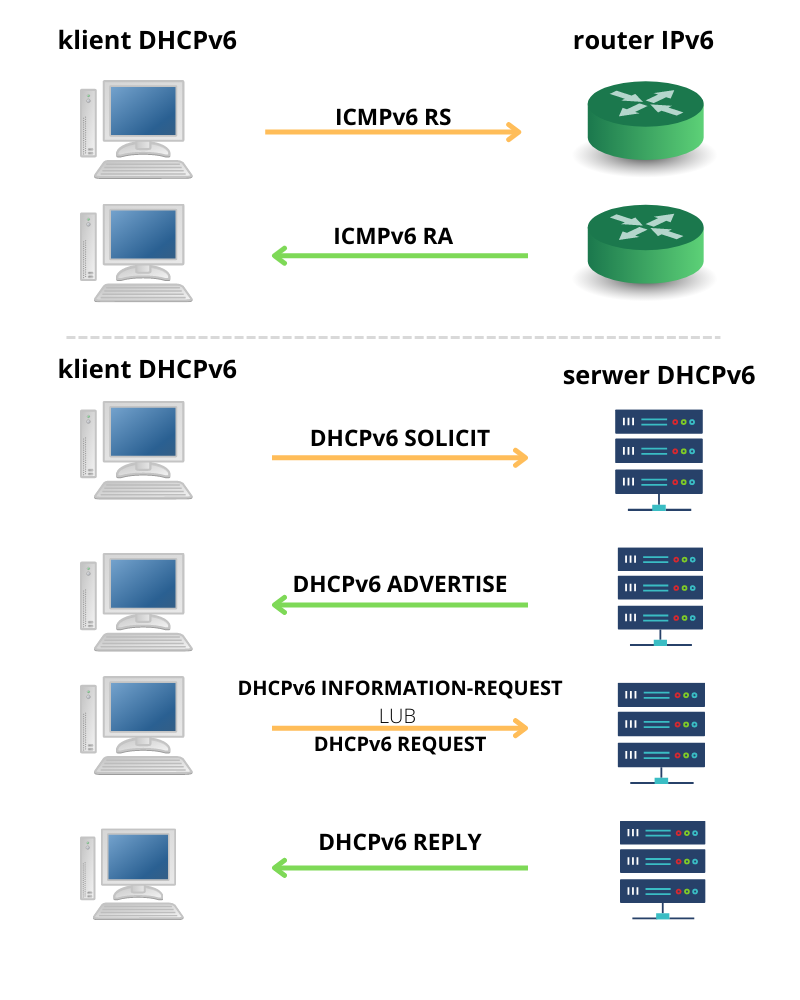

# Protokoły dynamicznej konfiguracji hosta

**Przydatne linki**

- [dr inż. Maciej Sobieraj - Rozdział 8: DHCP](http://maciej.sobieraj.pracownik.put.poznan.pl/PWSZ/W08_2018.pdf)
- [David Bombal - DHCP Explained - Step by Step Server Configuration](https://www.youtube.com/watch?v=Dp2mFo3YSDY)
- [NetworkAcademy.io - IPv6 Stateless Address Auto-configuration (SLAAC)](https://www.networkacademy.io/ccna/ipv6/stateless-address-autoconfiguration-slaac)
- [NetworkAcademy.io - Stateful DHCPv6](https://www.networkacademy.io/ccna/ipv6/stateful-dhcpv6)
- [NetworkAcademy.io - Stateless DHCPv6](https://www.networkacademy.io/ccna/ipv6/stateless-dhcpv6)

**Spis treści**
- [Protokoły dynamicznej konfiguracji hosta](#protokoły-dynamicznej-konfiguracji-hosta)
  - [DHCPv4](#dhcpv4)
    - [Wstęp](#wstęp)
    - [Działanie](#działanie)
    - [Konfiguracja routera Cisco jako serwer DHCP](#konfiguracja-routera-cisco-jako-serwer-dhcp)
    - [Sprawdzanie działania DHCP](#sprawdzanie-działania-dhcp)
      - [Sprawdzenie konfiguracji serwera](#sprawdzenie-konfiguracji-serwera)
      - [Sprawdzenie powiązań DHCP](#sprawdzenie-powiązań-dhcp)
      - [Sprawdzenie otrzymania adresu przez klienta](#sprawdzenie-otrzymania-adresu-przez-klienta)
      - [Ręczne odnowienie dzierżawy](#ręczne-odnowienie-dzierżawy)
    - [Konfiguracja routera Cisco jako klient DHCP](#konfiguracja-routera-cisco-jako-klient-dhcp)
  - [Dynamiczna konfiguracja adresów IPv6](#dynamiczna-konfiguracja-adresów-ipv6)
  - [SLAAC](#slaac)
    - [Flagi komunikatu RA](#flagi-komunikatu-ra)
    - [Generowanie ID interfejsu hosta](#generowanie-id-interfejsu-hosta)
    - [Przykład konfiguracji na routerze Cisco](#przykład-konfiguracji-na-routerze-cisco)
  - [DHCPv6](#dhcpv6)
    - [Stateless DHCPv6](#stateless-dhcpv6)
      - [Flagi komunikatu RA](#flagi-komunikatu-ra-1)
      - [Przykład konfiguracji routera Cisco jako serwer](#przykład-konfiguracji-routera-cisco-jako-serwer)
      - [Przykład konfiguracji routera Cisco jako klient](#przykład-konfiguracji-routera-cisco-jako-klient)
    - [Stateful DHCPv6](#stateful-dhcpv6)
      - [Flagi komunikatu RA](#flagi-komunikatu-ra-2)
      - [Przykład konfiguracji routera Cisco jako serwer](#przykład-konfiguracji-routera-cisco-jako-serwer-1)
      - [Przykład konfiguracji routera Cisco jako klient](#przykład-konfiguracji-routera-cisco-jako-klient-1)
    - [Konfiguracja *relay agent*](#konfiguracja-relay-agent)

## DHCPv4

### Wstęp

Zazwyczaj łącząc się z jakąś siecią, np. zwykłą domową siecią WiFi nie konfigurujemy adresu IP, maski podsieci, bramy domyślnej i serwera DNS ręcznie - byłoby to upierdliwe robiąc to za każdym razem prawda? Zazwyczaj klikamy "połącz" i wszystko działa i śmiga jak należy. Dlaczego? Właśnie dzięki protokołowi *dynamicznej konfiguracji hosta* (*Dynamic Host Configuration Protocol*), który robi to za nas

### Działanie

DHCP działa w architekturze *klient-serwer* - serwer dzierżawi adres IPv4 klientowi, który o niego poprosi (logiczne). Klient musi co jakiś czas zwracać się do serwera z prośbą o przedłużenie dzierżawy - adresy nie są przypisywane raz na zawsze. Gdy, przkładowo, komputer zostanie przeniesiony do innej sieci, nieużywany adre po wygaśnięciu dzierżawy wraca do puli dostępnych adresów IP i będzie mógł zostać przypisany następnemu urządzeniu.

Najpierw host rozgłasza wiadomość **DHCPDISCOVER** w celu odkrycia adresu serwera DHCP. Serwer otrzymując tą wiadomość dodaje wpis do tablicy ARP i rezerwuje dostępny adres IP z puli, następnie odsyła wiadomość unicast **DHCPOFFER** korzystając z adresu MAC klienta. Klient otrzymawszy odpowiedź rozgłasza komunikat **DHCPREQUEST** w celu poinformowania swojego serwera jak również pozostałych serwerów DHCP w sieci o akceptacji dzierżawy adresu IP (ten komunikat jest również wysyłany w celu odnowienia dzierżawy). Na koniec serwer odpowiada komunikatem **DHCPACK**, który jest duplikatem wiadomości DHCPOFFER, ale ze zmienionym typem wiadomości. Po otrzymaniu tej wiadomości, klient wykonuje zapytanie ARP dla przypisanego mu adresu - jeśli nie uzyska odpowiedzi to znaczy, że przypisany mu adres IP jest prawidłowy i może go używać jako własny.



W celu odnowienia dzierżawy zostają wymienione wiadomości DHCPREQUEST i DHCPACK między klientem a serwerem (tym razem DHCPREQUEST jest unicastem)

### Konfiguracja routera Cisco jako serwer DHCP

```
Router(config)#ip dhcp excluded-address 192.168.8.1
Router(config)#ip dhcp excluded-address 192.168.8.250 192.168.8.254
Router(config)#ip dhcp pool POOL1
Router(dhcp-config)#network 192.168.8.0 255.255.255.0
Router(dhcp-config)#default-router 192.168.8.1
Router(dhcp-config)#dns-server 192.168.8.1
Router(dhcp-config)#domain-name example.lan
Router(dhcp-config)#end
Router#
```

W powyższym przykładzie najpierw wykluczamy adresy z puli dostępnych adresów: `192.168.8.1` i od `192.168.8.250` do `192.168.8.254` (adresy te nie będą dzierżawione klientom). Następnie tworzymy nową pulę adresów o nazwie *POOL1*, w której ustawiamy takie informacje jak sieć, brama domyślna, serwer DNS czy nazwa domeny. 

W przypadku, gdy serwer DHCP znajduje się w innej sieci, możemy skonfigurować na interfejsie *adres pomocniczy*, który będzie przekazywał (*relay*) żądania do odpowiedniego serwera DHCP

```
Router(config)#interface g0/1
Router(config-if)#ip helper-address 192.168.4.20
Router(config-if)#
```

### Sprawdzanie działania DHCP

#### Sprawdzenie konfiguracji serwera

```
Router#show running-config | section dhcp
ip dhcp excluded-address 10.0.0.1
ip dhcp excluded-address 192.168.8.1
ip dhcp excluded-address 192.168.8.250 192.168.8.254
ip dhcp pool POOL1
 network 192.168.8.0 255.255.255.0
 default-router 192.168.8.1
 dns-server 192.168.8.1
 domain-name example.lan
Router#
```

#### Sprawdzenie powiązań DHCP

```
Router#show ip dhcp binding 
IP address       Client-ID/              Lease expiration        Type
                 Hardware address
10.0.0.5         00D0.FFC9.0B44           --                     Automatic
10.0.0.4         00E0.A328.97B6           --                     Automatic
10.0.0.6         0009.7C26.1591           --                     Automatic
10.0.0.3         0060.47E7.0217           --                     Automatic
10.0.0.2         00E0.8F7A.1D84           --                     Automatic
10.0.0.7         0007.EC94.740E           --                     Automatic
Router#
```

#### Sprawdzenie otrzymania adresu przez klienta

```
C:\>ipconfig /all

FastEthernet0 Connection:(default port)

   Connection-specific DNS Suffix..: example.lan
   Physical Address................: 0009.7C26.1591
   Link-local IPv6 Address.........: FE80::209:7CFF:FE26:1591
   IPv6 Address....................: ::
   IPv4 Address....................: 192.168.8.2
   Subnet Mask.....................: 255.255.255.0
   Default Gateway.................: ::
                                     192.168.8.1
   DHCP Servers....................: 192.168.8.1
   DHCPv6 IAID.....................: 
   DHCPv6 Client DUID..............: 00-01-00-01-3A-9D-2D-EE-00-09-7C-26-15-91
   DNS Servers.....................: ::
                                     192.168.8.1
```

#### Ręczne odnowienie dzierżawy

```
C:\>ipconfig /release

   IP Address......................: 0.0.0.0
   Subnet Mask.....................: 0.0.0.0
   Default Gateway.................: 0.0.0.0
   DNS Server......................: 0.0.0.0

C:\>ipconfig /renew

   IP Address......................: 192.168.8.2
   Subnet Mask.....................: 255.255.255.0
   Default Gateway.................: 192.168.8.1
   DNS Server......................: 192.168.8.1

C:\>
```

### Konfiguracja routera Cisco jako klient DHCP

Routery również mogą mieć przypisywane adresy poprzez DHCP. Nasze routery domowe często dostają adresy na porcie WAN od serwera DHCP należącego do dostawcy usług internetowych (ISP).

Przykładowa kofniguracja:

```
Router(config)#interface g0/1
Router(config-if)#ip address dhcp
Router(config-if)#no shutdown

Router(config-if)#
```

## Dynamiczna konfiguracja adresów IPv6

Adres IPv6 GUA można skonfigurować z wykorzystaniem jednej z trzech metod:

- **SLAAC** (*stateless address autoconfiguration*) - host sam konfiguruje adres IPv6 oraz wszystko co potrzebne korzystając z informacji otrzymanych od routera
- **SLAAC + bezstanowy DHCPv6** - host sam konfiguruje swój adres IPv6 oraz kontaktuje się z serwerem DHCPv6 w celu uzupełnienia pozostałych informacji
- **Stanowy DHCPv6** - router powiadamia hosta, że ten powinien skontaktować się z serwerem DHCPv6, od którego pobierze adres IPv6 oraz wszystkie niezbędne informacje

Router co 200 sekund wysyła komunikat ICMPv6 RA (*router advertisement*) informujący o sposobie konfiguracji adresu IPv6. Zawiera trzy flagi:

- **A** (*autokonfiguracja adresu*) - użyj SLAAC
- **O** (*inna konfiguracja*) - użyj SLAAC i bezstanowy DHCPv6
- **M** (*zarządzana konfiguracja adresu*) - użyj stanowego DHCPv6

Router wyśle również komunikat RA na żądanie klienta, gdy ten wyśle komunikat ICMPv6 RS (*router solicitation*) na adres multicast `ff02::2` (wszystkie routery IPv6).

Adres LLA (*link-local*) jest tworzony automatycznie po uruchomieniu interfejsu z IPv6

## SLAAC

SLAAC jest usługą bezstanową, czyli nie ma żadnego serwera zarządzającego przydzielaniem adresów IPv6 GUA. Host sam tworzy swój adres korzystając z danych zawartych w komunikacie RA

### Flagi komunikatu RA

flaga | wartość
:-: | :-:
A | 1
O | 0
M | 0

### Generowanie ID interfejsu hosta

Istnieją dwie możliwości utworzenia identyfikatora interfejsu hosta w adresie IPv6:

- **losowo generowany** - system operacyjny generuje losowy 64-bitowy identyfikator
- **EUI-64** - host używa swojego adresu MAC (48 bitów) i wstawia *w środku* 12-bitową wartość `fffe`

Część systemów korzysta z pierwszej metody ze względu na obawy dotyczące prywatności w przypadku EUI-64 (adres MAC identyfikuje fizyczne urządzenie i zawiera dane producenta).

Nie ma gwarancji, że wygenerowany ID interfejsu będzie unikatowy, dlatego hosty korzystają z procesu *DAD* (wykrywanie duplikatów adresów) w celu wykrycia konfliktów.

Po utworzeniu ID interfejsu, host wysyła wiadomość ICMPv6 NS (*neighbor solicitation*) na odpowiedni adres multicast *solicited-node*. Jeśli nie otrzyma odpowiedzi w postaci komunikatu ICMPv6 NA (*neighbor advertisement*), oznacza to, że wygenerowany adres jest unikatowy.

### Przykład konfiguracji na routerze Cisco

```
Router(config)#ipv6 unicast-routing 
```

SLAAC jest domyślną opcją po włączeniu routingu IPv6

## DHCPv6

Komunikaty *serwer-klient* korzystają z portu docelowego UDP 546, a *klient-serwer* z UDP 547

Kroki w celu pobrania informacji od serwera DHCPv6 i ewentualnego wydzierżawienia adresu IPv6:

1. host wysyła wiadomość RS
2. router odpowiada RA informując, aby klient zgłosił się do serwera DHCPv6
3. klient próbuje zlokalizować serwer DHCPv6 wysyłając komunikat **DHCPv6 SOLICIT** na adres multicast `ff02::1:2`
4. przynajmniej jeden serwer DHCPv6 odpowiada komunikatem **DHCPv6 ADVERTISE**
5. odpwiedź hosta zależy od tego, czy DHCPv6 jest stanowy czy bezstanowy:
   - **stanowy** - host wysyła do serwera komunikat **DHCPv6 REQUEST** w celu uzyskania adresu IPv6 i wszystkich potrzebnych parametrów konfiguracji
   - **bezstanowy** - host sam tworzy swój adres IPv6 korzystając z prefiksu zawartego w komunikacie RA oraz generując identyfikator interdajsu, a następnie wysyła do serwera DHCPv6 wiadomość **DHCPv6 INFORMATION-REQUEST** w celu uzyskania pozostałych potrzebnych parametrów konfiguracji
6. serwer wysyła do klienta komunikat **DHCPv6 REPLY**



### Stateless DHCPv6

#### Flagi komunikatu RA

flaga | wartość
:-: | :-:
A | 1
O | 1
M | 0

#### Przykład konfiguracji routera Cisco jako serwer

```
Router(config)#ipv6 unicast-routing 
Router(config)#ipv6 dhcp pool IPV6_STATELESS
Router(config-dhcpv6)#dns-server 2001:dead:beef:1::1
Router(config-dhcpv6)#domain-name example.lan
Router(config-dhcpv6)#exit
Router(config)#interface g0/1
Router(config-if)#ipv6 address fe80::1 link-local
Router(config-if)#ipv6 address 2001:dead:beef:1::1/64
Router(config-if)#ipv6 nd other-config-flag
Router(config-if)#ipv6 dhcp server IPV6_STATELESS
Router(config-if)#no shut
Router(config-if)#end
Router#
```

#### Przykład konfiguracji routera Cisco jako klient

```
Router#enable
Router#configure terminal
Enter configuration commands, one per line.  End with CNTL/Z.
Router(config)#ipv6 unicast-routing
Router(config)#interface g0/1
Router(config-if)#ipv6 enable
Router(config-if)#ipv6 address autoconfig
Router(config-if)#end
Router#
```

### Stateful DHCPv6

#### Flagi komunikatu RA

flaga | wartość
:-: | :-:
A | 0
O | 0
M | 1

#### Przykład konfiguracji routera Cisco jako serwer

```
Router(config)#ipv6 unicast-routing 
Router(config)#ipv6 dhcp pool IPV6_STATEFUL
Router(config-dhcpv6)#address prefix 2001:dead:beef:1::/64
Router(config-dhcpv6)#dns-server 2001:dead:beef:1::1
Router(config-dhcpv6)#domain-name example.lan
Router(config-dhcpv6)#exit
Router(config)#interface g0/1
Router(config-if)#ipv6 address fe80::1 link-local
Router(config-if)#ipv6 address 2001:dead:beef:1::1/64
Router(config-if)#ipv6 nd managed-config-flag
Router(config-if)#ipv6 nd prefix default no-autoconfig
Router(config-if)#ipv6 dhcp server IPV6_STATEFUL
Router(config-if)#no shut
Router(config-if)#end
Router#
```

#### Przykład konfiguracji routera Cisco jako klient

```
Router(config)#ipv6 unicast-routing 
Router(config)#interface g0/1
Router(config-if)#ipv6 enable
Router(config-if)#ipv6 address dhcp
Router(config-if)#end
Router#
```

### Konfiguracja *relay agent*

Jeśli serwer DHCPv6 znajduje się w innej sieci, router można skonfigurować jako *agenta przekazywania* (*relay agent*), który przekaże dalej komunikaty DHCPv6

```
Router(config)#interface g0/1
Router(config-if)#ipv6 dhcp relay destination 2001:dead:beef:2::1 g0/0
```
