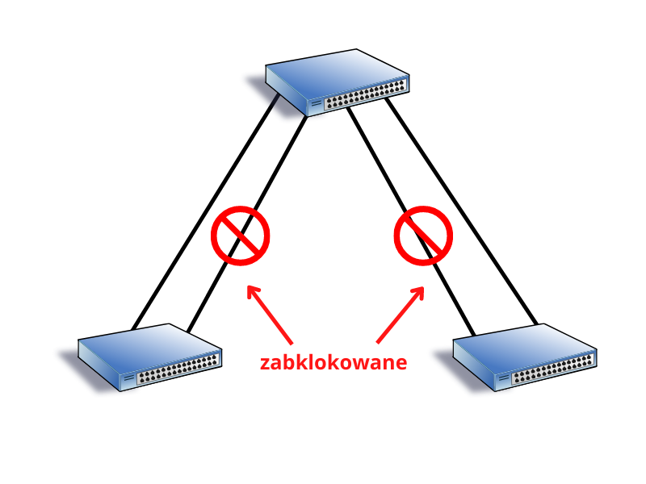

# EtherChannel - agregacja łączy

**Przydatne linki**

- [Pasja informatyki - Przełącznik CISCO: Hasła, Użytkownicy, SSH, Port Monitor, Etherchannel](https://www.youtube.com/watch?v=Ntbt47XKSXg)
- [Keith Barker - Layer 2 EtherChannel | Cisco CCNA 200-301](https://www.youtube.com/watch?v=-7_PuMos2h8)
- [NetAdminPro - Protokół EtherChannel Pagp](https://netadminpro.pl/protokol-etherchannel-pagp/)
- [CertBros - EtherChannel Explained | Concept & Configuration](https://www.youtube.com/watch?v=j6-kadxwIFQ)

**Spis treści**
- [EtherChannel - agregacja łączy](#etherchannel---agregacja-łączy)
  - [Czym jest EtherChannel?](#czym-jest-etherchannel)
  - [Protokół PAgP](#protokół-pagp)
  - [Protokół LACP](#protokół-lacp)
  - [Konfiguracja](#konfiguracja)
    - [Przykład PAgP](#przykład-pagp)
    - [Przykład LACP](#przykład-lacp)
    - [Weryfikacja](#weryfikacja)

## Czym jest EtherChannel?

Pewnego razu, pewien admin odkrył nadmiarowość w sieciach komputerowych i stwierdził, że to jest dobre. Jednak nadmiarowość łączy może prowadzić do pętli w warstwie drugiej, które są bardzo niebezpieczne dla sieci. Na ratunek przybył protokół [STP](https://en.wikipedia.org/wiki/Spanning_Tree_Protocol), jednak blokuje on nadmiarowe łącza. W tej sytuacji nie mamy zbyt wielu korzyści z redundancji



Wykorzystanie pełnego potencjału nadmiarowych łączy zapewnia technologia ***EtherChannel***, która agreguje kilka fizycznych łączy między dwoma przełącznikami w jedno logiczne łącze. Dzięki temu zyskujemy większe pasmo, równoważenie obciążenia, a protokół STP nie blokuje nadmiarowych połączeń.

EtherChannel ma pewne ograniczenia. Nie można mieszać typów interfejsów - w ramach jednego EtherChannel nie mogą być połączone interfejsy FastEthernet i GigabitEthernet. Dodatkowo pojedynczy kanał może obejmować do ośmiu (zgodnie skonfigurowanych) portów.

Kanały można utworzyć na drodze negocjacji z wykorzystaniem jednego z dwóch protokołów

## Protokół PAgP

*Port Aggregation Protocol* to zastrzeżony protokół Cisco. Obsługuje tryby:

- **on** - wymusza uruchomienie portu bez protokołu PAgP. Tak skonfigurowane interfejsy nie wymieniają między sobą pakietów PAgP
- **desirable** - port zostaje uruchomiony w trybie aktywnej negocjacji. Tak skonfigurowany port wysyła pakiety PAgP inicjując negocjacje
- **auto** - port zostaje uruchomiony w trybie pasywnej negocjacji. Tak skonfigurowany port odpowiada na otrzymane pakiety PAgP, ale nie inicjuje negocjacji

## Protokół LACP

*Link Aggregation Control Protocol* jest standardem IEEE (*IEEE 802.3ad* i *IEEE 802.1AX*) i zapewnia podobną funkcjonalność co PAgP. Ponieważ jest standardem IEEE, nadaje się do wykorzystania w środowisku, w którym wykorzystywane są przełączniki różnych producentów.

Obsługuje tryby:

- **on** - port uruchamiany jest bez użycia LACP. Interfejsy nie wymieniają ze sobą pakietów LACP
- **active** - interfejs zostaje uruchomiony w trybie aktywnej negocjacji - wysyła pakiety LACP inicjując negocjacje
- **passive** - interfejs zostaje uruchomiony w trybie pasywnej negocjacji - odpowiada na odebrane pakiety LACP, ale nie inicjuje negocjacji

## Konfiguracja

Aby utworzyć kanał EtherChannel należy pamiętać o następujących wytycznych:

- wszystkie interfejsy muszą obsługiwać EtherChannel
- muszą pracować z tą samą prędkością i w tym samym trybie dupleksu
- muszą należeć do tej samej sieci VLAN
- w przypadku łączy trunk musi być ten sam zakres dozwolonych sieci VLAN

### Przykład PAgP

```
Switch(config)#interface range f0/1,f0/5
Switch(config-if-range)#channel-group 1 mode desirable
Switch(config-if-range)#exit
Switch(config)#interface port-channel 1
Switch(config-if)#switchport mode trunk
Switch(config-if)#switchport trunk allowed vlan 1,10,20
```

### Przykład LACP

```
Switch(config)#interface range f0/1,f0/5
Switch(config-if-range)#channel-group 1 mode active
Switch(config-if-range)#exit
Switch(config)#interface port-channel 1
Switch(config-if)#switchport mode trunk
Switch(config-if)#switchport trunk allowed vlan 1,10,20
```

### Weryfikacja

```
Switch#show etherchannel summary
Flags:  D - down        P - in port-channel
        I - stand-alone s - suspended
        H - Hot-standby (LACP only)
        R - Layer3      S - Layer2
        U - in use      f - failed to allocate aggregator
        u - unsuitable for bundling
        w - waiting to be aggregated
        d - default port


Number of channel-groups in use: 1
Number of aggregators:           1

Group  Port-channel  Protocol    Ports
------+-------------+-----------+----------------------------------------------

1      Po1(SU)           PAgP   Fa0/1(P) Fa0/5(P) 
Switch#
```

```
Switch#show etherchannel port-channel 
                Channel-group listing:
                ----------------------

Group: 1
----------
                Port-channels in the group:
                ---------------------------

Port-channel: Po1
------------

Age of the Port-channel   = 00d:00h:05m:43s
Logical slot/port   = 2/1       Number of ports = 2
GC                  = 0x00000000      HotStandBy port = null
Port state          = Port-channel 
Protocol            =   PAGP
Port Security       = Disabled

Ports in the Port-channel:

Index   Load   Port     EC state        No of bits
------+------+------+------------------+-----------
  0     00     Fa0/1    Desirable-Sl       0
  0     00     Fa0/5    Desirable-Sl       0
Time since last port bundled:    00d:00h:05m:37s    Fa0/5
Switch#
```

```
Switch#show interfaces etherchannel 
----
FastEthernet0/1:
Port state    = 1
Channel group = 1           Mode = Desirable-S1    Gcchange = 0
Port-channel  = Po1         GC   = 0x00000000      Pseudo port-channel = Po1
Port index    = 0           Load = 0x00            Protocol =   PAgP

Flags:  S - Device is sending Slow hello.  C - Device is in Consistent state.
        A - Device is in Auto mode.        P - Device learns on physical port.
        d - PAgP is down.
Timers: H - Hello timer is running.        Q - Quit timer is running.
        S - Switching timer is running.    I - Interface timer is running.

Local information:
                                Hello    Partner  PAgP     Learning  Group
Port      Flags State   Timers  Interval Count   Priority   Method  Ifindex
Fa0/1     d     U1/S1   H30s    1        0        128        Any      0

Partner's information:
          Partner              Partner          Partner         Partner Group
Port      Name                 Device ID        Port       Age  Flags   Cap.
Fa0/1     Switch               0001.97B0.20CC   Fa0/1      0    SC     10001    

Age of the port in the current state:  00d:00h:06m:38s

----
FastEthernet0/5:
Port state    = 1
Channel group = 1           Mode = Desirable-S1    Gcchange = 0
Port-channel  = Po1         GC   = 0x00000000      Pseudo port-channel = Po1
Port index    = 0           Load = 0x00            Protocol =   PAgP

Flags:  S - Device is sending Slow hello.  C - Device is in Consistent state.
        A - Device is in Auto mode.        P - Device learns on physical port.
        d - PAgP is down.
Timers: H - Hello timer is running.        Q - Quit timer is running.
        S - Switching timer is running.    I - Interface timer is running.

Local information:
                                Hello    Partner  PAgP     Learning  Group
Port      Flags State   Timers  Interval Count   Priority   Method  Ifindex
Fa0/5     d     U1/S1   H30s    1        0        128        Any      0

Partner's information:
          Partner              Partner          Partner         Partner Group
Port      Name                 Device ID        Port       Age  Flags   Cap.
Fa0/5     Switch               0001.97B0.20CC   Fa0/5      0    SC     10001    

Age of the port in the current state:  00d:00h:06m:38s

----
Port-channel1:Port-channel1
Age of the Port-channel   = 00d:00h:06m:43s
Logical slot/port   = 2/1             Number of ports = 2
GC                  = 0x00000000      HotStandBy port = null
Port state          = 
Protocol            =   2
Port Security       = Disabled

Ports in the Port-channel:

Index   Load   Port     EC state        No of bits
------+------+------+------------------+-----------
  0     00     Fa0/1    Desirable-Sl       0
  0     00     Fa0/5    Desirable-Sl       0
Time since last port bundled:    00d:00h:06m:38s    Fa0/5

Switch#
```