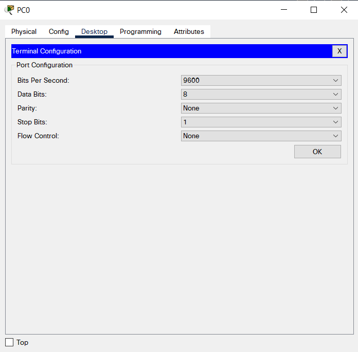

# Podstawowa kofiguracja urządzeń Cisco (ściągawka)

Do ćwiczenia symulowania sieci komputerowych i konfiguracji urządzeń można wykorzystać program [Cisco Packet Tracer](https://www.netacad.com/courses/packet-tracer)

Przydatne linki:
- [Pasja informatyki - Konfiguracja urządzeń sieciowych](https://www.youtube.com/playlist?list=PLOYHgt8dIdoxl9sk2mowQ7jceuappnh4L)
- [Cisco Packet Tracer](https://www.netacad.com/courses/packet-tracer)
- [Cisco IOS Configuration Fundamentals Command Reference](https://www.cisco.com/c/en/us/td/docs/ios/fundamentals/command/reference/cf_book.html)
- [Konfigurowanie sieciowego systemu operacyjnego](http://maciej.sobieraj.pracownik.put.poznan.pl/PWSZ/W05_2018.pdf)
- [Networking Devices and Initial Configuration](https://skillsforall.com/course/networking-devices-and-initial-configuration)

**Spis treści**
- [Podstawowa kofiguracja urządzeń Cisco (ściągawka)](#podstawowa-kofiguracja-urządzeń-cisco-ściągawka)
  - [System Operacyjny Cisco IOS](#system-operacyjny-cisco-ios)
  - [Przed konfiguracją](#przed-konfiguracją)
  - [Konfiguracja podstawowych ustawień](#konfiguracja-podstawowych-ustawień)
    - [Pomoc](#pomoc)
    - [Przełączanie się między trybami poleceń systemu](#przełączanie-się-między-trybami-poleceń-systemu)
    - [Podstawowe ustawienia](#podstawowe-ustawienia)
      - [Nazwa hosta](#nazwa-hosta)
      - [Polecenie `show`](#polecenie-show)
      - [Ustawianie hasła dla trybu uprzywilejowanego](#ustawianie-hasła-dla-trybu-uprzywilejowanego)
      - [Baner powitalny](#baner-powitalny)
      - [Hasło konsoli](#hasło-konsoli)
      - [Hasło do zdalnego dostępu](#hasło-do-zdalnego-dostępu)
      - [Szyfrowanie haseł](#szyfrowanie-haseł)
    - [Konfiguracja SSH](#konfiguracja-ssh)
    - [Zapisywanie konfiguracji](#zapisywanie-konfiguracji)
    - [Filtrowanie wyników polecenia `show`](#filtrowanie-wyników-polecenia-show)
    - [Historia poleceń](#historia-poleceń)
  - [Konfiguracja przełącznika](#konfiguracja-przełącznika)
    - [Konfiguracja SVI](#konfiguracja-svi)
    - [Konfiguracja bramy domyślnej](#konfiguracja-bramy-domyślnej)
    - [Sprawdzanie statusu interfejsów](#sprawdzanie-statusu-interfejsów)
    - [Ustawianie dupleksu i szybkości portu](#ustawianie-dupleksu-i-szybkości-portu)
    - [Auto-MDIX](#auto-mdix)
    - [Polecenia weryfikacyjne](#polecenia-weryfikacyjne)
      - [informacje o stanie i konfiguracji interfejsu](#informacje-o-stanie-i-konfiguracji-interfejsu)
      - [wyświetlanie konfiguracji startowej](#wyświetlanie-konfiguracji-startowej)
      - [Wyświetlanie bieżącej konfiguracji](#wyświetlanie-bieżącej-konfiguracji)
      - [Wyświetlanie informacji o systemie plików pamięci flash](#wyświetlanie-informacji-o-systemie-plików-pamięci-flash)
      - [Wyświetlanie statusu sprzętu i oprogramowania](#wyświetlanie-statusu-sprzętu-i-oprogramowania)
      - [Wyświetlanie historii wprowadzonych poleceń](#wyświetlanie-historii-wprowadzonych-poleceń)
      - [Wyświetlanie informacji związanych z adresem IP interfejsu](#wyświetlanie-informacji-związanych-z-adresem-ip-interfejsu)
      - [Wyświetlanie tablicy adresów MAC przełącznika](#wyświetlanie-tablicy-adresów-mac-przełącznika)
  - [Konfiguracja routera](#konfiguracja-routera)
    - [Konfiguracja interfejsów](#konfiguracja-interfejsów)
    - [Konfiguracja interfejsu pętli zwrotnej](#konfiguracja-interfejsu-pętli-zwrotnej)
    - [Polecenia weryfikacji interfejsu](#polecenia-weryfikacji-interfejsu)
      - [Sprawdzenie stanu interfejsu](#sprawdzenie-stanu-interfejsu)
      - [Sprawdzanie tras](#sprawdzanie-tras)

## System Operacyjny Cisco IOS

Tak jak komputery, switche i routery Cisco mają swój system operacyjny. Można wchodzić z nim w interakcję poprzez interfejs wiersza poleceń (CLI)

Tryby poleceń Cisco IOS:
- user EXEC mode
- privileged EXEC mode
- tryb konfiguracji globalnej

## Przed konfiguracją

Zanim rozpoczniemy kofigurację urządzenia sieciowego, musimy podłączyć się do niego przy użyciu kabla konsolowego i portu konsoli.

W programie **Cisco Packet Tracer** wybierz (lewy dolny róg okna programu) PC z kategorii *End Devices* oraz urządzenie sieciowe (przełącznik lub router) z kategorii *Network Devices*


Następnie wybierz kabel konsolowy (*Console*) z kategorii *Connections*


Kliknij na komputer PC i wybierz port **RS 232**


Potem kliknij na przełącznik (lub router) i wybierz **Console**


Teraz twoje urządzenia są połączone za pomocą kabla konsolowego


Kliknij na PC i wybierz zakładkę *Desktop*


Wybierz **Terminal**



Kliknij **OK** i Enter


Teraz możesz przejść do konfigurowania urządzenia sieciowego.

Alternatywnie zamiast używać połączenia konsolowego można po prostu kliknąć na urządzenie sieciowe i wybrać zakładkę *CLI*


## Konfiguracja podstawowych ustawień

Podstawowe ustawienia konfiguruje się tak samo na przełączniku i na routerze.

### Pomoc

Aby uzyskać pomoc o danym poleceniu wystarczy dodać `?`

```
S1#c?
clear  clock  configure  connect  copy 
```

```
S1#copy ?
  flash:          Copy from flash: file system
  ftp:            Copy from ftp: file system
  running-config  Copy from current system configuration
  scp:            Copy from scp: file system
  startup-config  Copy from startup configuration
  tftp:           Copy from tftp: file system
```

Dodatkowo, podobnie jak w innych systemach operacyjnych, przycisk `Tab` spowoduje uzupełnienie polecenia na podstawie jego początkowych wpisanych znaków

### Przełączanie się między trybami poleceń systemu

Podłączając się do CLI wita nas znak zachęty trybu EXEC użytkownika, zapewniający dostęp do podstawowych komend:

```
Switch>
```

Aby uzyskać dostęp do wszystkich poleceń, należy wejść w tryb uprzywilejowany EXEC, korzystając z polecenia `enable`:

```
Switch>enable
Switch#
```

Żeby móc zmieniać ustawienia urządzenia, należy przejść do trybu konfiguracji globalnej z poziomu uprzywilejowanego użytkownika. Służy do tego polecenie `configure terminal`

```
Switch#configure terminal 
Enter configuration commands, one per line.  End with CNTL/Z.
Switch(config)#
```

Aby wrócić z powrotem do trybu privileged EXEC, należy wpisać polecenie `end`

```
Switch(config)#end
Switch#
%SYS-5-CONFIG_I: Configured from console by console

Switch#
```

### Podstawowe ustawienia

#### Nazwa hosta

Do zmiany nazwy hosta służy polecenie `hostname <name>`

```
Switch(config)#hostname S1
S1(config)#
```

#### Polecenie `show`

To polecenie trybu uprzywilejowanego pozwala na wyświetlanie różnych informacji o systemie, np. `show running-config`

```
S1#show running-config 
Building configuration...

Current configuration : 1076 bytes
!
version 15.0
no service timestamps log datetime msec
no service timestamps debug datetime msec
no service password-encryption
!
hostname S1
!
!
!
!
!
!
spanning-tree mode pvst
spanning-tree extend system-id
!
interface FastEthernet0/1
!
interface FastEthernet0/2
 --More-- 
```

#### Ustawianie hasła dla trybu uprzywilejowanego

Do ustawiennia hasła dla trybu privileged EXEC `enable password <password>` lub `enable secret <password>`. Różnica polega na tym, że pierwsze polecenie tworzy hasło przechowywane w postaci zwykłego tekstu, a drugie w postaci szyfrogramu

```
S1(config)#enable password cisco
S1(config)#do show run
Building configuration...

Current configuration : 1100 bytes
!
version 15.0
no service timestamps log datetime msec
no service timestamps debug datetime msec
no service password-encryption
!
hostname S1
!
enable password cisco
!
!
!
!
!
!
spanning-tree mode pvst
spanning-tree extend system-id
!
interface FastEthernet0/1
 --More-- 
```

```
S1(config)#enable secret cisco
S1(config)#do show run
Building configuration...

Current configuration : 1125 bytes
!
version 15.0
no service timestamps log datetime msec
no service timestamps debug datetime msec
no service password-encryption
!
hostname S1
!
enable secret 5 $1$mERr$hx5rVt7rPNoS4wqbXKX7m0
!
!
!
!
!
!
spanning-tree mode pvst
spanning-tree extend system-id
!
interface FastEthernet0/1
 --More-- 
```

#### Baner powitalny

Taka wiadomość może służyć, np. aby dać ostrzeżenie, że nieautoaryzowany dostęp od urządzenia jest zabroniony

```
S1(config)#banner motd #Authorized Access Only!#
```

#### Hasło konsoli

Tryb user EXEC (w przypadku bezpośredniego dostępu do urządzenia) można również zabezpieczyć ustawiając hasło

```
S1(config)#line console 0
S1(config-line)#password cisco
S1(config-line)#login
S1(config-line)#exit
S1(config)#
```

#### Hasło do zdalnego dostępu

[Meaning of line vty 0 4 in configuration of Cisco Router or Switch](https://ipwithease.com/what-is-meaning-of-line-vty-0-4-in-configuration-of-cisco-router-or-switch/)

Przełącznik i routery mają coś takiego jak linie *VTY* - *Virtual teletype*, które pozwalają na zdalny dostęp do urządzenia. polecenie `line vty 0 4` oznacza, że urządzenie może obsłużyć do pięciu jednoczesnych połączeń poprzez Telnet lub SSH. Maksymalnie tych linii można skonfigurować 16 (0 - 15)

```
S1(config)#line vty 0 4
S1(config-line)#password cisco
S1(config-line)#login
S1(config-line)#exit
S1(config)#
```

#### Szyfrowanie haseł

Powyższe hasła domyślnie są przechowywane w postaci zwykłego tekstu, jednak szyfrowanie haseł można włączyć

```
S1(config)#service password-encryption 
```

### Konfiguracja SSH

Ze względów bezpieczeństwa nie należy nigdy używać Telnet. Jako bezpieczną alternatywę dla tego protokołu należy wybrać SSH

```
S1#show ip ssh
SSH Disabled - version 1.99
%Please create RSA keys (of atleast 768 bits size) to enable SSH v2.
Authentication timeout: 120 secs; Authentication retries: 3
S1#configure terminal
Enter configuration commands, one per line.  End with CNTL/Z.
S1(config)#ip domain-name cisco.com
S1(config)#crypto key generate rsa
The name for the keys will be: S1.cisco.com
Choose the size of the key modulus in the range of 360 to 2048 for your
  General Purpose Keys. Choosing a key modulus greater than 512 may take
  a few minutes.

How many bits in the modulus [512]: 1024
% Generating 1024 bit RSA keys, keys will be non-exportable...[OK]

S1(config)#username admin secret cisco
*Mar 2 17:52:40.499: %SSH-5-ENABLED: SSH 1.99 has been enabled
S1(config)#line vty 0 4
S1(config-line)#transport input ssh
S1(config-line)#login local
S1(config-line)#exit
S1(config)#ip ssh version 2
S1(config)#exit
S1#
%SYS-5-CONFIG_I: Configured from console by console

S1#show ip ssh
SSH Enabled - version 2.0
Authentication timeout: 120 secs; Authentication retries: 3
S1#
```

### Zapisywanie konfiguracji

Zmiany wprowadzone powyżej są zapisane w konfiguracji bieżącej w pamięci RAM, co oznacza, że po ponownym uruchomieniu urządzenia owa konfiguracja zostanie utracona. Aby temu zapobiec, należy skopiować bieżącą konfigurację do konfiguracji startowej

```
S1#copy running-config startup-config 
Destination filename [startup-config]? 
Building configuration...
[OK]
S1#
```

### Filtrowanie wyników polecenia `show`

Wynik komendy show można filtrować za pomocą znaku `|` (*pipe*)

- `section` - Pokazuje całą sekcję rozpoczynającą się od wyrażenia filtrującego

```
S1#show running-config | section line vty
line vty 0 4
 password 7 0822455D0A16
 login local
 transport input ssh
line vty 5 15
 login
S1#
```

- `include` - Obejmuje wszystkie wiersze wyjściowe pasujące do wyrażenia filtrującego

```
S1#show ip interface brief | include up
FastEthernet0/1        unassigned      YES manual up                    up 
FastEthernet0/2        unassigned      YES manual up                    up 
FastEthernet0/3        unassigned      YES manual up                    up 
FastEthernet0/4        unassigned      YES manual up                    up 
GigabitEthernet0/1     unassigned      YES manual up                    up 
Vlan1                  unassigned      YES manual up                    up 
Vlan99                 192.168.8.4     YES manual up                    up
S1#
```

- `exclude` - Wyklucza wszystkie wiersze wyjściowe pasujące do wyrażenia filtrującego

```
Router#show ip interface brief | exclude up
Interface              IP-Address      OK? Method Status                Protocol 
GigabitEthernet0/1     unassigned      YES unset  administratively down down 
Vlan1                  unassigned      YES unset  administratively down down
Router#
```

- `begin` - Pokazuje wszystkie linie wyjściowe z określonego punktu, zaczynając od linii pasującej do wyrażenia filtrującego

```
Router#show ip route | begin Gate
Gateway of last resort is not set

     10.0.0.0/8 is variably subnetted, 2 subnets, 2 masks
C       10.0.0.0/24 is directly connected, Loopback0
L       10.0.0.1/32 is directly connected, Loopback0
     192.168.8.0/24 is variably subnetted, 2 subnets, 2 masks
C       192.168.8.0/24 is directly connected, GigabitEthernet0/0
L       192.168.8.1/32 is directly connected, GigabitEthernet0/0

Router#
```

### Historia poleceń

Wciskając klawisz strzałki w górę można przywołać poprzednie wpisane komendy. Domyślnie bufor historii wpisanych komend wynosi 10, ale można go zmienić za pomocą polecenia `terminal history size <liczba>`

```
Router#terminal history size 100
Router#show his
Router#show history 
  en
  terminal history size 100
  show history 
Router#
```

## Konfiguracja przełącznika

### Konfiguracja SVI

Żeby móc zdalnie konfigurować przełącznik, musi on mieć przypisany adres IP i maskę podsieci na wirtualnym interfejsie przełącznika (*switch virtual interface*), który nie jest fizycznym portem urządzenia, a interfejsem wirtualnym.

```
S1#configure terminal 
Enter configuration commands, one per line.  End with CNTL/Z.
S1(config)#interface vlan 1
S1(config-if)#ip address 192.168.8.2 255.255.255.0
S1(config-if)#no shutdown
```

### Konfiguracja bramy domyślnej

Żeby móc konfigurować przełącznik z innej sieci, musi on mieć skonfigurowaną bramę domyślną

```
S1(config)#ip default-gateway 192.168.8.1
```

### Sprawdzanie statusu interfejsów

Do sprawdzenia poprawności konfiguracji interfejsów służy polecenie `show ip interface brief`

```
S1#show ip interface brief 
Interface              IP-Address      OK? Method Status                Protocol 
FastEthernet0/1        unassigned      YES manual up                    up 
(wyniki pominięto)
Vlan1                  192.168.8.2     YES manual up                    up
S1#
```

### Ustawianie dupleksu i szybkości portu

Służą do tego odpowiednio polecenia `duplex` i `speed` trybu konfiguracji interfejsu

```
S1(config)#interface FastEthernet 0/2
S1(config-if)#duplex full
S1(config-if)#speed 100
```

### Auto-MDIX

Można też włączyć funkcję **Auto-MDIX**, aby interfejs automatycznie wykrył typ kabla i odpowiednio skonfigurował połączenie

```
S1(config-if)#mdix auto
```

### Polecenia weryfikacyjne

#### informacje o stanie i konfiguracji interfejsu

```
S1# show interfaces [interface-id]
```

np.

```
S1#show interfaces f0/2
```

#### wyświetlanie konfiguracji startowej

```
S1# show startup-config
```

#### Wyświetlanie bieżącej konfiguracji

```
S1# show running-config
```

#### Wyświetlanie informacji o systemie plików pamięci flash

```
S1# show flash
```

#### Wyświetlanie statusu sprzętu i oprogramowania

```
S1# show version
```

#### Wyświetlanie historii wprowadzonych poleceń

```
S1# show history
```

#### Wyświetlanie informacji związanych z adresem IP interfejsu

```
S1# show ip interface brief
```

lub

```
S1# show ipv6 interface brief
```

#### Wyświetlanie tablicy adresów MAC przełącznika

```
S1# show mac-address-table
```

lub

```
S1# show mac address-table
```

## Konfiguracja routera

### Konfiguracja interfejsów

```
Router>enable
Router#configure terminal
Enter configuration commands, one per line.  End with CNTL/Z.
Router(config)#interface gigabit 0/0
Router(config-if)#ip address 192.168.8.1 255.255.255.0
Router(config-if)#description Siec LAN 1
Router(config-if)#no shutdown
Router(config-if)#exit
Router(config)#
```

### Konfiguracja interfejsu pętli zwrotnej

[What is loopback interface in a Cisco Router](https://www.omnisecu.com/cisco-certified-network-associate-ccna/what-is-loopback-interface-in-a-router.php)

```
Router(config)#interface loopback 0

Router(config-if)#
%LINK-5-CHANGED: Interface Loopback0, changed state to up

%LINEPROTO-5-UPDOWN: Line protocol on Interface Loopback0, changed state to up

Router(config-if)#ip address 10.0.0.1 255.255.255.0
Router(config-if)#exit
Router(config)#
```

### Polecenia weryfikacji interfejsu

#### Sprawdzenie stanu interfejsu

```
Router#show ip interface gigabitEthernet 0/0
GigabitEthernet0/0 is up, line protocol is up (connected)
  Internet address is 192.168.8.1/24
  Broadcast address is 255.255.255.255
  Address determined by setup command
  MTU is 1500 bytes
  Helper address is not set
  Directed broadcast forwarding is disabled
  Outgoing access list is not set
  Inbound  access list is not set
  Proxy ARP is enabled
  Security level is default
  Split horizon is enabled
  ICMP redirects are always sent
  ICMP unreachables are always sent
  ICMP mask replies are never sent
  IP fast switching is disabled
  IP fast switching on the same interface is disabled
  IP Flow switching is disabled
  IP Fast switching turbo vector
  IP multicast fast switching is disabled
  IP multicast distributed fast switching is disabled
  Router Discovery is disabled
 --More-- 
```

#### Sprawdzanie tras

```
Router#show ip route
Codes: L - local, C - connected, S - static, R - RIP, M - mobile, B - BGP
       D - EIGRP, EX - EIGRP external, O - OSPF, IA - OSPF inter area
       N1 - OSPF NSSA external type 1, N2 - OSPF NSSA external type 2
       E1 - OSPF external type 1, E2 - OSPF external type 2, E - EGP
       i - IS-IS, L1 - IS-IS level-1, L2 - IS-IS level-2, ia - IS-IS inter area
       * - candidate default, U - per-user static route, o - ODR
       P - periodic downloaded static route

Gateway of last resort is not set

     10.0.0.0/8 is variably subnetted, 2 subnets, 2 masks
C       10.0.0.0/24 is directly connected, Loopback0
L       10.0.0.1/32 is directly connected, Loopback0
     192.168.8.0/24 is variably subnetted, 2 subnets, 2 masks
C       192.168.8.0/24 is directly connected, GigabitEthernet0/0
L       192.168.8.1/32 is directly connected, GigabitEthernet0/0

Router#
```