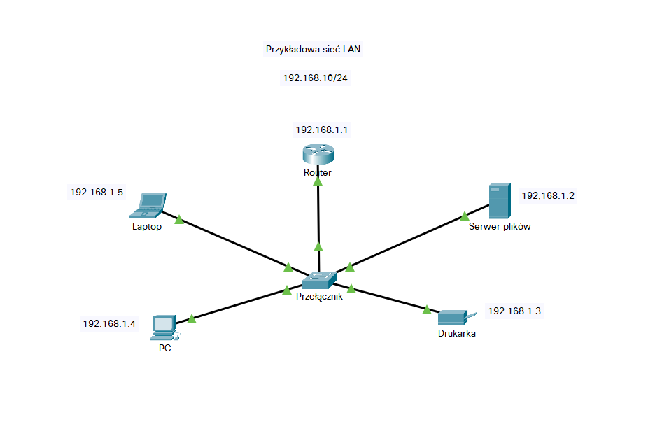
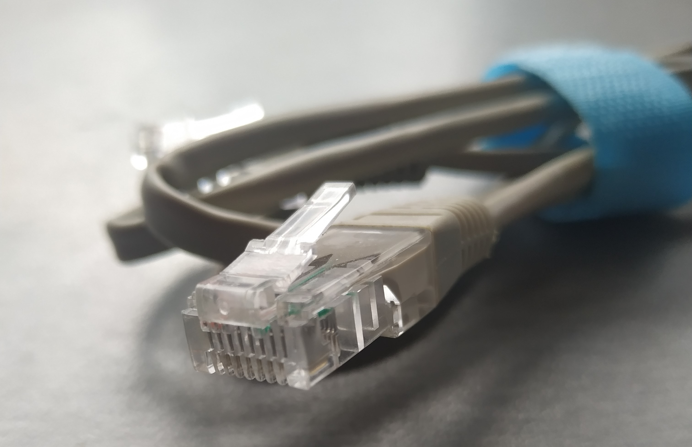
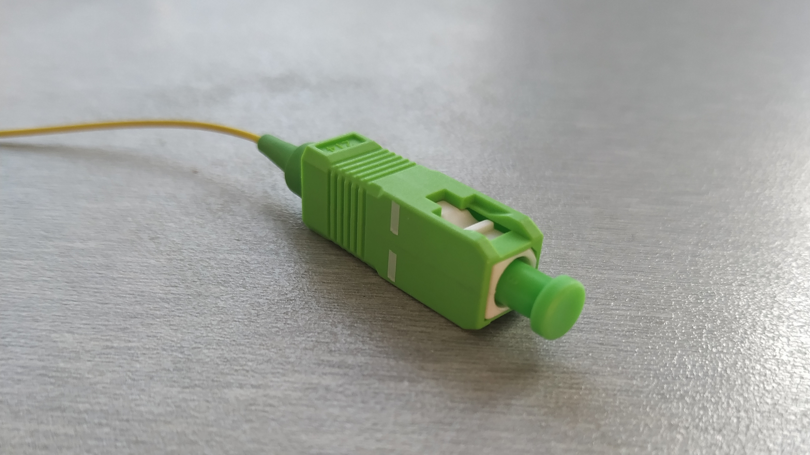
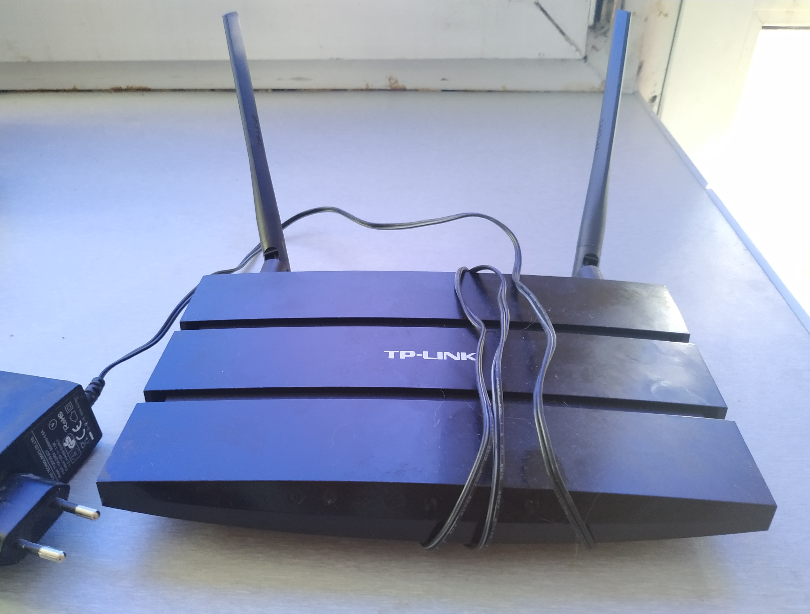
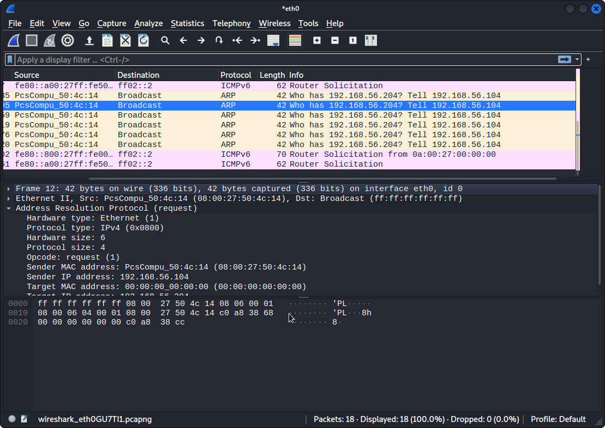
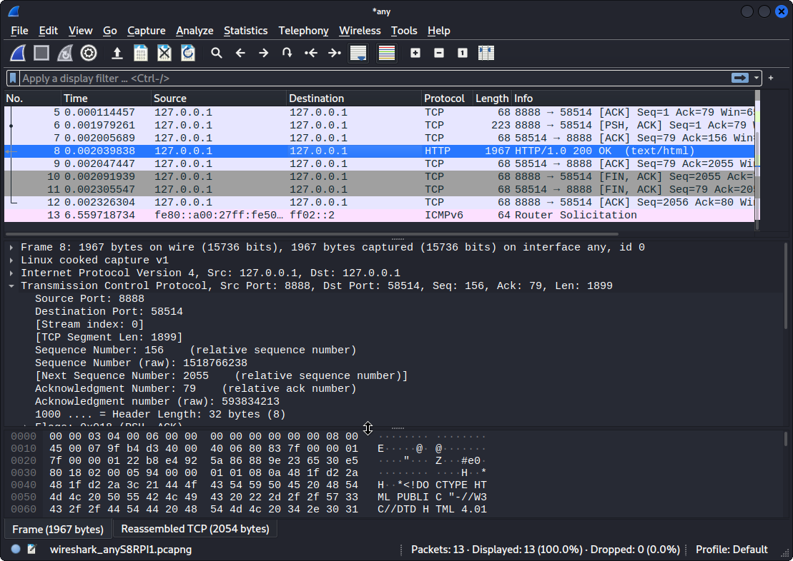
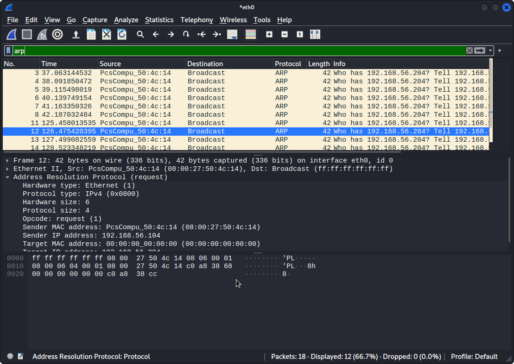
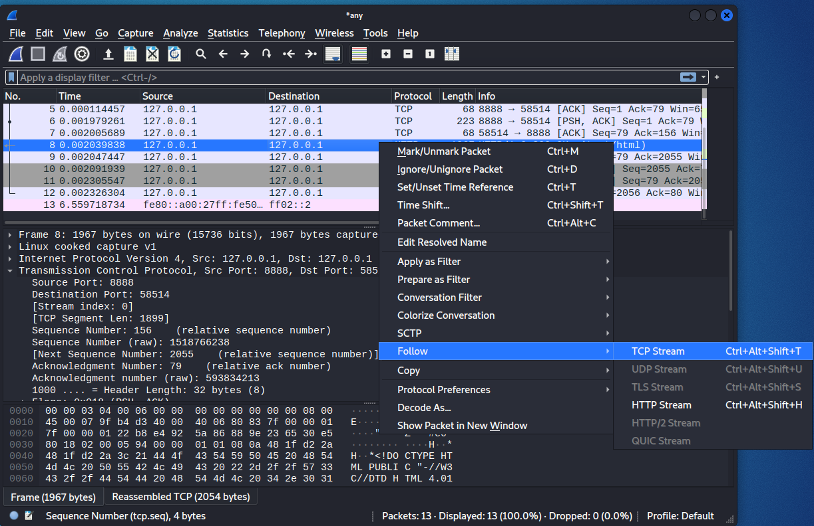
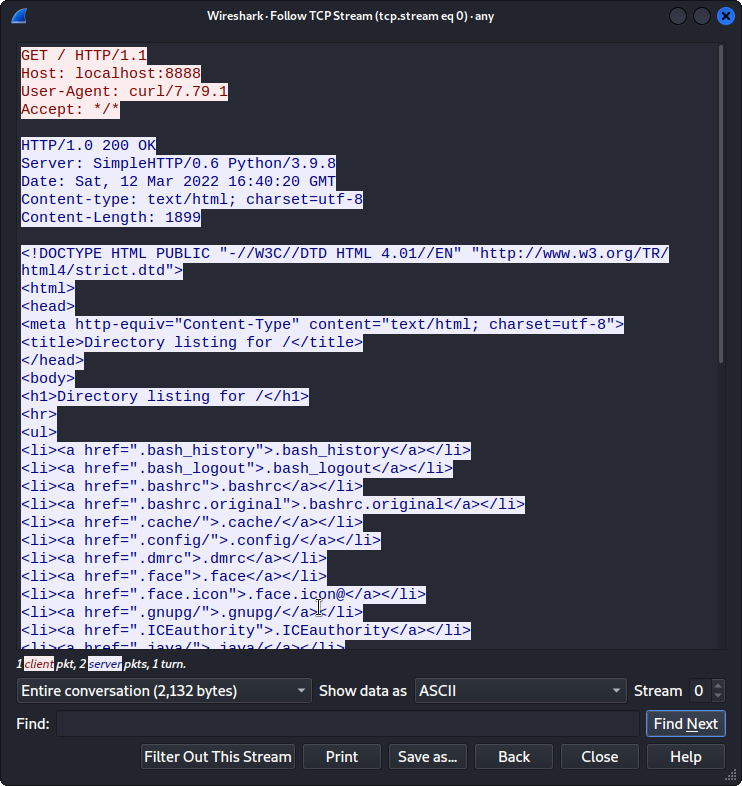

# Sieci komputerowe (wprowadzenie)

[Politechnika Poznańska: Sieci Komputerowe I](https://www.cs.put.poznan.pl/ddwornikowski/sieci/sieci1/index.html)

[Pasja informatyki: Sieci komputerowe E13 E15 E16 EE08](https://www.youtube.com/playlist?list=PLOYHgt8dIdoz2fyn0gv4fs2t4tayalsh3)

**Sieć komputerowa** to komputery i inne _środki techniczne_ połączone ze sobą w celu wymiany i dostępu do informacji

Urządzenia końcowe (ang. _end device_) (takie jak laptopy, stacje robocze, drukarki, telefony) nazwywamy **hostami** (ang. _hosts_)

**Sieci konwergentne** dostarczają danych, głos i wideo między wieloma różnymi typami urządzeń w tej samej infrastrukturze sieciowej

**Spis treści**
- [Sieci komputerowe (wprowadzenie)](#sieci-komputerowe-wprowadzenie)
  - [Rodzaje sieci](#rodzaje-sieci)
    - [SOHO](#soho)
    - [Sieć lokalna](#sieć-lokalna)
    - [Sieć rozległa](#sieć-rozległa)
    - [Intranet](#intranet)
    - [Ekstranet](#ekstranet)
  - [Sposoby reprezentacji sieci](#sposoby-reprezentacji-sieci)
    - [Topologia fizyczna](#topologia-fizyczna)
    - [Topologia logiczna](#topologia-logiczna)
    - [Przykładowa sieć](#przykładowa-sieć)
  - [Architektury](#architektury)
    - [klient-serwer](#klient-serwer)
    - [peer-to-peer](#peer-to-peer)
  - [Połączenie z Internetem](#połączenie-z-internetem)
  - [Niezawodność sieci](#niezawodność-sieci)
  - [Trendy sieciowe](#trendy-sieciowe)
  - [Protokoły](#protokoły)
  - [Organizacje normalizacyjne](#organizacje-normalizacyjne)
  - [Modele referencyjne](#modele-referencyjne)
    - [Model OSI](#model-osi)
      - [Warstwa 1 - fizyczna](#warstwa-1---fizyczna)
      - [Warstwa 2 - łącza danych](#warstwa-2---łącza-danych)
      - [Warstwa 3 - sieci](#warstwa-3---sieci)
      - [Warstwa 4 - transportu](#warstwa-4---transportu)
      - [Warstwa 5 - sesji](#warstwa-5---sesji)
      - [Warstwa 6 - prezentacji](#warstwa-6---prezentacji)
      - [Warstwa 7 - aplikacji](#warstwa-7---aplikacji)
    - [Model TCP/IP](#model-tcpip)
  - [TCP vs UDP](#tcp-vs-udp)
    - [TCP](#tcp)
    - [UDP](#udp)
  - [Urządzenia sieciowe](#urządzenia-sieciowe)
    - [Przełącznik](#przełącznik)
    - [Router](#router)
  - [Media transmisyjne](#media-transmisyjne)
    - [Kabel miedziany (impulsy elektryczne)](#kabel-miedziany-impulsy-elektryczne)
    - [Światłowód (impulsy świetlne)](#światłowód-impulsy-świetlne)
    - [Media bezprzewodowe (mikrofale)](#media-bezprzewodowe-mikrofale)
  - [Przełączanie w sieciach Ethernet](#przełączanie-w-sieciach-ethernet)
  - [Odwzorowanie adresów](#odwzorowanie-adresów)
  - [Adresowanie IPv4](#adresowanie-ipv4)
    - [Adresy _prywatne_](#adresy-prywatne)
  - [Adresowanie IPv6](#adresowanie-ipv6)
    - [Rodzaje adresów IPv6](#rodzaje-adresów-ipv6)
    - [Dynamiczne adresowanie dla GUA IPv6](#dynamiczne-adresowanie-dla-gua-ipv6)
  - [Podstawy bezpieczeństwa sieci](#podstawy-bezpieczeństwa-sieci)
    - [Zagrożenia](#zagrożenia)
    - [Główne podatności lub luki](#główne-podatności-lub-luki)
    - [Cztery klasy zagrożeń fizycznych](#cztery-klasy-zagrożeń-fizycznych)
    - [Malware (_malicious software_) - złośliwe oprogramowanie](#malware-malicious-software---złośliwe-oprogramowanie)
    - [Kategorie ataków sieciowych](#kategorie-ataków-sieciowych)
    - [Rozpoznawanie ataków](#rozpoznawanie-ataków)
    - [Rodzaje ataków dostępu](#rodzaje-ataków-dostępu)
    - [Zapobieganie](#zapobieganie)
  - [Obserwacja ruchu sieciowego](#obserwacja-ruchu-sieciowego)
    - [Program Wireshark](#program-wireshark)

## Rodzaje sieci

### SOHO

**SOHO** (small office/home office) pozwala komputerom w biurze (np. domowym) łączyć się z siecią korporacji lub uzyskać dostęp do scentralizowanych współdzielonych zasobów

### Sieć lokalna

**LAN** (_Local Area Network_) to sieć łącząca urządzenia na małym obszarze geograficznym. Może to być sieć w jednym pomieszczeniu lub budynku, np. w domu.

### Sieć rozległa

**WAN** (_Wide Area Network_) to infrastruktura sieciowa rozpościerająca się na dużym obszarze geograficznym

### Intranet

Wewnętrzna, odizolowana sieć należąca do organizacji

### Ekstranet

Sieć zapewniająca bezpieczny dostęp osobom, które pracują dla innej organizacji, ale wymagają dostępu do danych organizacji

## Sposoby reprezentacji sieci

**Topologia** to reprezentacja sieci, rysunek

### Topologia fizyczna

**Topoligia fizyczna** opisuje fizyczne połączenia między urządzeniami, układy przewodów, użyte media transmisyjne i rozmieszczenie urządzeń w budynku, kampusie etc.

**Topologie fizyczne LAN**:

- gwiazda
- rozszerzona gwiazda
- magistrala
- pierścień

**Topologie fizyczne WAN**:

- punkt-punkt
- hub and spoke
- siatka

### Topologia logiczna

**Topologia logiczna** opisuje logiczne połączenia między urządzeniami, sposoby komunikacji, adresację urządzeń, użyte interfejsy itp.

### Przykładowa sieć



Przykładowa sieć utworzona została przy użyciu oprogramowania [Cisco Packet Tracer](https://www.netacad.com/courses/packet-tracer). Do symulacji sieci komputerowych możesz również skorzystać z alternatywy, jaką jest [Imunes](http://imunes.net/)

## Architektury

### klient-serwer

**Serwer** - urządzenie z oprogramowaniem oferującym usługi lub zasoby

**Klient** - urządzenie z oprogramowaniem korzystającym z usług lub zasobów udostępnianych przez serwer

### peer-to-peer

Urządzenie może być jednocześnie klientem i serwerem (przykład: _torrenty_)

## Połączenie z Internetem

**SOHO**:

- sieci kablowe
- DSL
- sieci komórkowe
- łącza satelitarne
- dial-up

**Połączenia biznesowe**:

- dedykowana linia dzierżawiona
- Metro Ethernet
- Buisness DSL
- łącza satelitarne

## Niezawodność sieci

- odporność na awarie
  - redundancja
- skalowalność
- jakość usług (_QoS_)
- bezpieczeństwo
  - poufność
  - integralność
  - dostępność

## Trendy sieciowe

- Bring Your Own Device (_BYOD_)
- współpraca online
- komunikacja wideo
- przetwarzanie w chmurze
  - chmury publiczne
  - chmury prywatne
  - chmury hybrydowe
  - chmury niestandardowe
- technologia _smart-home_
- sieć Powerline
- WISP
- WLAN

## Protokoły

**Protokoły** to ścisłe zbiory reguł i intrukcje postępowania w komunikacji sieciowej, które są automatycznie wykonywane przez urządzenia w celu komunikacji i wymiany informacji

Do ról i cech protokołów należą:

- zidentyfikowany nadawca i odbiorca
- wspólny język i gramatyka
- szybkość i czas dostawy, potwierdzenie odbioru wiadomości
- kodowanie wiadomości
- formatowanie
- enkapsulacja
- rozmiar i opcje dostawy

**Zestaw protokołów** to grupa powiązanych ze sobą protokołów niezbędnych do wykonywania funkcji komunikacyjnej, np. TCP/IP

## Organizacje normalizacyjne

**Otwarte standardy** wspierają interoperacyjność, konkurencyjność i innowację

**Promowanie i tworzenie standardów dla Internetu**:

- ISOC
- IAB
- IETF
- IRTF

**Rozwijanie i obsługiwanie TCP/IP**:

- ICANN
- IANA

**Standardy elektroniczne i komunikacyjne**:

- IEEE
- EIA
- TIA
- ITU-T

## Modele referencyjne

[Pasja informatyki: Sieci komputerowe odc. 2 - Modele ISO/OSI i TCP/IP](https://www.youtube.com/watch?v=3eJncZ1FdZ0)

<style type="text/css">
.tg  {border-collapse:collapse;border-spacing:0;}
.tg td{border-color:black;border-style:solid;border-width:1px;font-family:Arial, sans-serif;font-size:14px;
  overflow:hidden;padding:10px 5px;word-break:normal;}
.tg th{border-color:black;border-style:solid;border-width:1px;font-family:Arial, sans-serif;font-size:14px;
  font-weight:normal;overflow:hidden;padding:10px 5px;word-break:normal;}
.tg .tg-baqh{text-align:center;vertical-align:top}
.tg .tg-amwm{font-weight:bold;text-align:center;vertical-align:top}
</style>
<table class="tg">
<thead>
  <tr>
    <th class="tg-baqh"><span style="font-weight:bold">OSI</span></th>
    <th class="tg-amwm">TCP/IP</th>
  </tr>
</thead>
<tbody>
  <tr>
    <td class="tg-baqh">aplikacji<br></td>
    <td class="tg-baqh" rowspan="3">aplikacji</td>
  </tr>
  <tr>
    <td class="tg-baqh">prezentacji</td>
  </tr>
  <tr>
    <td class="tg-baqh">sesji</td>
  </tr>
  <tr>
    <td class="tg-baqh">transportu</td>
    <td class="tg-baqh">transportu</td>
  </tr>
  <tr>
    <td class="tg-baqh">sieci</td>
    <td class="tg-baqh">Internetu</td>
  </tr>
  <tr>
    <td class="tg-baqh">łącza danych</td>
    <td class="tg-baqh" rowspan="2">dostępu do sieci</td>
  </tr>
  <tr>
    <td class="tg-baqh">fizyczna</td>
  </tr>
</tbody>
</table>

### Model OSI

nr| warstwa
| :---: | :---:
7 | aplikacji
6 | prezentacji
5 | sesji
4 | transportu
3 | sieci
2 | łącza danych
1 | fizyczna

#### Warstwa 1 - fizyczna

Obwody elektroniczne, media transmisyjne i złącza zaprojektowane przez inżynierów, komponenty fizyczne, kodowanie, sygnalizacja

**Pojęcia**:

- **szerokość pasma** (_bandwidth_) - zdolność medium do przenoszenia danych i ilość danych, które mogą przepłynąć z jednego miejsca do drugiego w określonym przedziale czasu
- **przepustowość** (_throughput_) - miara transferu bitów przez media w danym okresie czasu
- **opóźnienie** (_latency_) - zwłoka czasowa dla danych podróżujących z jednego punktu do drugiego
- **przepustowość efektywna** - miara dla przetransferowanych użytecznych danych w podanym okresie czasu

#### Warstwa 2 - łącza danych

[Pasja informatyki: Sieci komputerowe odc. 6 - Warstwa łącza danych, Ethernet, ARP](https://www.youtube.com/watch?v=-VURBAo6Hqo)

Przygotowuje dane sieciowe dla sieci fizycznej, jest odpowiedzialna za komunikację z karty sieciowej do karty sieciowej

**Podwarstwy**:
- **MAC** (_Medium Access Control_) - enkapsulacja danych poprzez ograniczenie ramki, adresowanie, wykrywanie błędów
- **LLC** (_Logical Link Control_) - określenie protokołu używanego przez warstwę sieciową

**Organizacje**:
- IEEE
- ITU
- ANSI

**Half-duplex** - wymiana danych w jednym kierunku na raz

**Full-duplex** - wysyła i odbiera dane jednocześnie

**Metody kontroli dostępu dla mediów współdzielonych**:

- dostęp oparty na rywalizacji
  - CSMA/CD (LAN Ethernet)
  - CSMA/CA (WLAN)
- dostęp kontrolowany

**Trzy podstawowe części ramki łącza danych**:

- nagłówek
- dane
- stopka

**Protokoły**:

- Ethernet
- 802.11 Wireless
- PPP
- HDLC
- Frame Relay

Adres warstwy łącza danych służy wyłącznie do **dostarczania lokalnego**

#### Warstwa 3 - sieci

[Pasja informatyki: Sieci komputerowe odc. 5 - Warstwa sieciowa - wprowadzenie do rutingu](https://www.youtube.com/watch?v=8R-5T8SXe44)

Umożliwia urządzeniom końcowym wymianę danych między sieciami

**Protokoły**:

- IPv4
- IPv6
- OSPF
- ICMP

**Zadania**:

- adresowanie urządzeń końcowych
- enkapsulacja
- routing
- dekapsulacja

Nagłówek IP jest badany przez router jak wędruje do miejsca docelowego

**Istotne pola pakietu IPv4**:

- wersja
- DS
- suma kontrolna
- czas życia
- protokół
- źródłowy i docelowy adres IPv4

**Pakiet IPv6**:

- rozwiązanie problemów IPv4
  - eliminacja potrzeby stosowania _NAT_
  - zwiększenie dostępnej przestrzeni adresowej
- pola
  - wersja
  - klasa ruchu
  - znacznik przepływu
  - długość ładunku
  - następny nagłówek
  - limit przeskoków
  - adres źródłowy
  - adres docelowy

Jak host prowadzi routing:

- IPv4
  - badanie adresu z użyciem własnej maski podsieci
- IPv6
  - sprawdzanie prefiksu, który rozgłasza router
- _brama domyślna_

Wyświetlenie talbicy routingu hosta (Windows)

```
C:\> route print
```

```
C:\> netstat -r
```

Tablica routingu routera przechowuje trzy typy wpisów trasy:

- bezpośrednio połączone sieci
- sieci zdalne
- trasa domyślna

#### Warstwa 4 - transportu

[Pasja informatyki: Sieci komputerowe odc. 4 - Warstwa transportowa](https://www.youtube.com/watch?v=W6QXRCzWr3c)

Warstwa transportu określa sposób dostarczenia danych między aplikacjami końcowymi. Wiąże się z tym wykrywanie błędów i ewentualna retransmisja utraconych danych

***Gniazdo*** (*socket*) to połączenie adresu IP i *numeru portu*, np. `192.168.8.1:8080`

***Numer portu*** to 16 bitowy numer identyfikujący uruchomioną na urządzeniu aplikację sieciową

*Grupy portów*:

- dobrze znane porty (0 - 1023)
- porty zarejestrowane (1024 - 49151)
- porty prywatne i/lub dynamiczne (49152 - 65535)

**Protokoły warstwy transportu**:
- [TCP](#tcp)
- [UDP](#udp)

#### Warstwa 5 - sesji

Rozpoczyna konwersacje, utrzymuje ich aktywność i wznawia je, jeśli zostały utracone lub są od dłuższego czasu bezczynne

#### Warstwa 6 - prezentacji

Do zadań warstwy prezentacji należą: formatowanie, kompresja czy szyfrowanie

#### Warstwa 7 - aplikacji

[Pasja informatyki: Sieci komputerowe odc. 3 - Warstwa aplikacji](https://www.youtube.com/watch?v=eb_2O3STPsI)

Jest to najbliższa użytkownikowi warstwa tego modelu. Zawiera protokoły takich typowych działań, jak
obsługa poczty elektronicznej, przesyłanie plików czy przeglądanie stron WWW

Protokoły popularnych usług:

- **HTTP** - dla stron WWW
- poczta elektroniczna
  - wysyłanie poczty: **SMTP**
  - pobieranie poczty:
    - **POP** - usuwa wiadomość z serwera po pobraniu
    - **IMAP** - pobiera kopię wiadomości
- **DNS** - odwzorowanie nazw domenowych na adresy IP:
  - DNS używa nazw domen do tworzenia hierarchii. Każdy serwer DNS utrzymuje konkretny plik bazy danych i jest odpowiedzialny za zarządzanie odwzorowaniem nazw na adresy IP tylko w tym małym wycinku całej struktury DNS
  - narzędzie `nslookup`
    ```batch
    C:\> nslookup google.com 8.8.8.8
    Server:  dns.google
    Address:  8.8.8.8

    Non-authoritative answer:
    Name:    google.com
    Addresses:  2a00:1450:401b:800::200e
              172.217.16.14
    ```
- dynamiczne konfigurowanie adresów IP hostów:
  - **DHCP** - dla IPv4:
    - Gdy urządzenie jest podłączane do sieci, klient DHCP rozgłasza komunikat DHCP DISCOVER w celu zidentyfikowania dostępnych serwerów DHCP. Serwer DHCP odpowiada komunikatem DHCPOFFER, który oferuje klientowi dzierżawę adresu
  - **DHCPv6** - dla IPv6:
    - komunikaty DHCPv6 to:
      - SOLICIT
      - ADVERTISE
      - INFORMATION REQUEST
      - REPLY
- transfer plików:
  - **FTP**:
    1. klient nawiązuje pierwsze połączenie z serwerem w celu kontrolowania ruchu przy użyciu portu TCP 21
    2. klient ustanawia drugie połączenie z serwerem w celu faktycznego transferu danych za pomocą portu TCP 20
    3. klient może pobierać dane z serwera lub przesyłać (wypychać) dane na serwer
  - **SMB**:
    - w przeciwieństwie do FTP, klienci nawiązują długoterminowe połączenia z serwerem
    - po ustanowieniu połączenia, użytkownik klienta ma dostęp do zasobów na serwerze tak, jakby były lokalne dla hosta klienta

### Model TCP/IP

To uproszczonya do czterech warstw wersja modelu OSI, w której:

- połączone w jedną wartwę są ze sobą warstwa fizyczna i łącza danych
- na warstwę aplikacji modelu TCP/IP składają się warstwy aplikacji, prezentacji i seji modelu OSI

nr | warstwa
| :---: | :---:
4 | aplikacji
3 | transportu
2 | Internetu
1 | dostępu do sieci

## TCP vs UDP

### TCP

**TCP** to protokół stanowy, niezawodny, potwierdza dane, ponownie przesyła utracone dane, dostarcza dane w kolejności sekwencyjne

**Pola nagłówka TCP**:

- port źródłowy
- port docelowy
- numer sekwencji
- numer potwierdzenia
- długość nagłówka
- zarezerwowane
- bity kontrolne
- rozmiar okna
- suma kontrolna
- pilne

Przykładowe aplikacje używające TCP:

- HTTP (WWW)
- FTP (transfer plików)
- SMTP (wysyłanie poczty)

**Flagi**:

- URG
- ACK
- PSH
- RST
- SYN
- FIN

**Trójetapowy proces uzgadniania**:

- klient wysyła *SYN*
- serwer odpowiada *SYN-ACK*
- klient potwierdza *ACK*

**Zakończenie sesji**

- jeden host wysyła *FIN*
- drugi host odpowiada *ACK*
- następnie też wysyła *FIN*
- pierwszy host potwierdza *ACK*

### UDP

**UDP** jest bezstanowy, szybki, ma niski narzut, nie wymaga potwierdzenia, nie wysyła ponownie utraconych danych, dostarcza dane w kolejności jakiej przybywają

**Pola nagłówka UDP**:

- port źródłowy
- port docelowy
- długość
- suma kontrolna

Przykładowe aplikacje korzystające z UDP:

- DHCP
- DNS
- SNMP
- TFTP
- VoIP

## Urządzenia sieciowe

[Pasja informatyki: Konfiguracja urządzeń sieciowych](https://www.youtube.com/playlist?list=PLOYHgt8dIdoxl9sk2mowQ7jceuappnh4L)

Urządzenia pośredniczące (_intermediary device_) są odpowiedzialne za przenoszenie ruchu między urządzeniami końcowymi w obrębie jednej sieci lub wielu

### Przełącznik

Urządzenie warstwy drugiej odpowiedzialne za przenoszenie ramek w sieci lokalnej

Przełącznik (_switch_) buduje w pamięci tablicę adresów MAC wykorzystując źródłowy adres MAC odebranej ramki oraz numer portu, z którego odebrał ową ramkę. Następnie sprawdza, czy ma w tablicy wpis zawierający docelowy adres MAC z ramki. Jeśli tak, wysyła ramkę określonym portem do miejsca docelowego. W przypadku, gdy docelowy adres MAC nie występuje w tablicy MAC, przełącznik wysyła ramkę na wszystkie porty, z wyjątkiem portu, z którego odebrał ramkę

### Router

Urządzenie warstwy trzeciej odpowiedzialne za wyznaczanie tras i przesyłanie pakietów między sieciami

Routery wykorzystują prefiks sieciowy docelowego adresu IP do kierowania pakietów do właściwego miejsca docelowego.

W momencie awarii wybierają dla pakietów alternatywną ścieżkę

Wszystkie hosty w sieci lokalnej umieszczają w swojej konfiguracji adres IP routera podłączonego do tej samej sieci jako adres _bramy domyślnej_. Bramy domyślnej hosty używają do wysyłania pakietów do odległych sieci

Router często też zapewnia takie usługi jak DHCP, NAT czy podstawowe funkcje zapory sieciowej

## Media transmisyjne

### Kabel miedziany (impulsy elektryczne)



**Zalety**:

- tanie
- łatwość instalacji
- mały opór

**Wady**:

- podatność na zakłócenia sygnału, np. interferencja elektromagnetyczna, przesłuch, zbyt duża długość kabla

**Rodzaje**:

- UTP
- STP
- koncentryczny

**UTP** (_skrętka_):

- cztery pary drutów oznaczonych kolorami, które zostały ze sobą skręcone, a następnie zamknięte w elastycznej osłonie z tworzywa sztucznego
- zwykle zakończony złączem **RJ-45**
- znoszenie i zróżnicowanie liczby skrętów na parę przewodów ogranicza negatywne skutki przesłuchu
- UTP jest zgodne z normami ustalonymi wspólnie przez TIA/EIA
- elektryczne właściwości kabli miedzianych są zdefiniowane przez IEEE
- główne typy kabli:
  - Ethernetowe proste i z przeplotem
  - rollover (konsolowy) - zastrzeżony przez Cisco, który łączy stację roboczą z portem konsoli routera

### Światłowód (impulsy świetlne)



Przesyła dane na większe odległości i z większą szerokością pasma niż jakikolwiek inny nośnik sieciowy

Stosowane w:

- sieciach przedsiębiorstw
- FTTH
- sieciach dalekiego zasięgu
- podmorskich sieciach kablowych

Typy łączy światłowych:

- ST
- SC
- LC
- duplex multimode LC

Patchcordy światłowodowe obejmują:

- wielomodowe SC-SC
- jednomodowe LC-LC
- wielomodowe ST-LC
- jednomodowe SC-ST

W większości sieci korporacyjnych są głównie stosowane w sieciach szkieletowych o dużym natężeniu ruchu w połączeniach _punkt-punkt_ i do łączenia sieci pomiędzy budynkami

### Media bezprzewodowe (mikrofale)



Przenoszą sygnały elektromagnetyczne, które reprezentują cyfry binarne przesyłanych danych używając fal radiowych i mikrofal

**Ograniczenia**:

- obszar zasięgu
- zakłócenia
- bezpieczeństwo

**Standardy**:

- Wi-Fi (_IEEE 802.11_)
- Bluetooth (_IEEE 802.15_)
- WiMAX (_IEEE 802.16_)
- Zigbee (_IEEE 802.15.4_)

WLAN (_Wireless LAN_) wymaga bezprzewodowego punktu dostępu *AP* (_access point_) i bezprzewodowej karty sieciowej

Typowy bezprzewodowy router domowy to najczęściej urządzenie 3 w 1: punkt dostępowy, router i przełącznik

## Przełączanie w sieciach Ethernet

**Pola ramki Ethernet**:

- preambuła i znacznik początku ramki
- docelowy adres MAC
- źródłowy adres MAC
- EtherType
- dane
- FCS

Adres MAC Ethernet to adres 48-bitowy wyrażony przy użyciu 12 cyfr szesnastkowych lub 6 bajtów. Składa się z sześciocyfrowego szesnastkowego kodu ***OUI*** dostawcy karty sieciowej, a następnie sześciocyfrowej szesnastkowej wartość=ci przypisanej przez dostawcę

Switch dynamicznie buduje _tablicę adresów MAC_ badając źródłowe adresy MAC ramek odebranych na porcie

**Metody przełączania**:

- store-and-forward
- cut-through
  - fast-forward
  - fragment-free

**Auto-MDIX** - automatyczne wykrywanie typu kabla podłączonego do portu i odpowiednia konfiguracja interfejsów

## Odwzorowanie adresów

Jeśli docelowy adres IP znajduje się w tej **samej sieci**, docelowym adresem MAC będzie **adres urządzenia docelowego**

Jeśli docelowy adres IP znajduje się w **sieci zdalnej**, docelowym adresem MAC będzie adres **bramy domyślnej** hosta

**ARP** (_Address Resolution Protocol_) mapuje adresy **IPv4** hostów na ich adresy MAC

Wyświetlenie tablicy ARP hosta:

```
C:\> arp -a
```

**ND** (_Neighbor Discovery Protocol_) mapuje adresy **IPv6** hostów na ich adresy MAC (z użyciem ICMPv6)

## Adresowanie IPv4

[Pasja informatyki: Adresowanie IP v4. Budowa adresów, obliczenia, podział na podsieci](https://www.youtube.com/watch?v=t3IceGlTjig)

Adres IPv4 to 32-bitowy adres hierarchiczny, który składa się z **części sieci** i **części hosta**

### Adresy _prywatne_

- 10.0.0.0 - 10.255.255.255 (10.0.0.0/8)
- 172.16.0.0 - 172.31.255.255 (172.16.0.0/12)
- 192.168.0.0 - 192.168.255.255 (192.168.0.0/16)

Adres _pętli zwrotnej_: 127.0.0.1

Zarówno IPv4 jak i IPv6 są zarządzane przez **IANA**, która przydziela bloki adresów IP do **RIR** (_Regional Internet Registry_)

Podsieci IPv4 są tworzone poprzez użycie jednego lub większej ilości bitów z części hosta jako bitów części sieci

**VLMS** - _Variable Length Subnet Mask_

## Adresowanie IPv6

[Pasja informatyki: Sieci komputerowe odc. 9 - Wprowadzenie do IPv6](https://www.youtube.com/watch?v=hRl2vX8CGpk)

**Problemy IPv4**:

- IPv4 ma teoretycznie 4.3 mld adresów
- adresy prywatne + NAT pomogły spowolnić wyczerpanie przestrzeni adresowej IPv4, jednak NAT utrudnia połączenia koniec-koniec

**Techniki migracji** z IPv4 na IPv6 można podzielić na 3 kategorie:

- podwójny stos
- tunelowanie
- translacja

Adres IPv6 ma długość 128 bitów zapisanych w postaci łańcucha wartości szesnastkowych. Każde 4 bity reprezentowane są przez jedną cyfrę szesnastkową, co daje w sumie 32 cyfry szesnastkowe

### Rodzaje adresów IPv6

- unicast
  - GUA
  - LLA
- multicast
- anycast

Adresy unikalne nie będą globalnie routowane

Adres GUA składa się z trzech części:

- prefiks routingu globalnego
- identyfikatora podsieci
- identyfikatora interfejsu

Adres _link-local_ (LLA) umożliwia urządzeniu komunikację z innymi urządzeniami w ramach jednej podsieci i tylko tej podsieci

### Dynamiczne adresowanie dla GUA IPv6

- routery IPv6 okresowo wysyłają komunikaty **ICMPv6 RA**, co 200 sekund, do wszystkich urządzenń z obsługą IPv6 w sieci
- komunikat RA zostaje również wysłany w odpowiedzi na komunikat **ICMPv6 RS** wysłanego z hosta, który jest żądaniem komunikatu RA

Komunikat RA ICMPv6 zawiera:

- prefiks sieciowy i długość przedrostka
- adres bramy domyślnej
- adresy DNS i nazwę domeny

Wiadomości RA obejmują metody:

- SLAAC
- SLAAC + bezstanowy (_stateless_) DHCPv6
- stanowy DHCPv6 (bez SLAAC)

**SLAAC** - klient korzysta z informacji zawartych w komunikacie RA, aby utworzyć własny adres GUA

**SLAAC + stateless DHCPv6** - komunikat RA sugeruje, że urządzenia używają SLAAC do tworzenia własnego GUA, używają routera LLA jako bramy domyślnej i używają bezstanowego serwera DHCPv6 w celu uzyskania innych niezbędnych informacji

**Stanowy DHCPv6** - RA sugeruje, że urządzenia używają routera LLA jako adresu bramy domyślnej, a stanowego serwera DHCPv6 w celu uzyskania GUA, adresu serwera DNS, nazwy domeny i wszystkich innych niezbędnych informacji

Identyfikator interfejsu można utworzyć przy użyciu procesu **EUI-64** lub losowo wygenerowanego numeru 64-bitowego

**EUI-64** używa 48-bitowego adresu MAC Ethernet klienta i wstawia kolejne 16 bitów w środku adresu MAC, aby utworzyć 64-bitowy identyfikator interfejsu

Istnieją 2 typy adresów multicast IPv6:

- dobrze znane adresy multicastowe
- adresy multicastowe solicited-node

Dwie grupy przypisanych multicastów:

- ff02::1 - all-nodes
- ff02::2 - all-routers

Zaletą adresu multicast solicited-node jest to, że jest on mapowany na specjalny adres multicastowy Ethernet

IPv6 został zaprojektowany z myślą o tworzeniu podsieci

## Podstawy bezpieczeństwa sieci

### Zagrożenia

- kradzież informacji
- utrata danych i manipulacja
- kradzież tożsamości
- zakłócenie usługi

### Główne podatności lub luki

- technologiczne
- konfiguracyjne
- dotyczące polityki bezpieczeństwa

### Cztery klasy zagrożeń fizycznych

- sprzęt
- środowisko
- elektryczne
- konserwacja

### Malware (_malicious software_) - złośliwe oprogramowanie

- wirusy
- robaki
- konie trojańskie

### Kategorie ataków sieciowych

- rekonesans
- ataki dostępu
- ataki odmowy wykonaia usługi (DoS)

### Rozpoznawanie ataków

- zapytania internetowe
- masowe testy `ping`
- skanowanie portów

### Rodzaje ataków dostępu

- ataki na hasło
  - siłowy
  - koń trojański
  - analiza pakietów
- wykorzystanie zaufania
- przekierowanie portów
- _man-in-the-middle_

### Zapobieganie

- kopie zapasowe
- aktualizowanie systemów
- VPN
- zapora ASA
- IPS
- ESA
- serwer AAA
  - uwierzytelnianie
  - autoryzacja
  - ewidencjonowanie
- DMZ
- zapory
  - filtrowanie pakietów
  - filtrowanie aplikacji
  - filtrowanie adresów URL
- oprogramowanie antywirusowe
- zmiana domyślnych danych uwierzytelniających
- stosowanie silnych haseł
- przechowywanie haseł w postaci zaszyfrowanej

## Obserwacja ruchu sieciowego

Do podglądania ruchu sieciowego i jego obserwacji służą programy zwane _snifferami_ (szperaczami) sieciowymi. **Sniffer** to oprogramowanie pozwalające przeglądać zawartość wysyłanych i odbieranych pakietów

### Program Wireshark

[Pasja informatyki: Sieci komputerowe odc. 7 - Podsłuchiwanie sieci: program Wireshark](https://www.youtube.com/watch?v=ujBQx46Dqr8)

Jednym z najbardziej popularnych snifferów jest program [Wireshark](https://www.wireshark.org/)

Możemy w nim zobaczyć zawartość pakietów przesyłanych przez sieć i zapisać plik z przechwyconymi pakietami, żeby przejrzeć go później





Możemy stosować filtry żeby obejrzeć ruch dotyczący np. tylko jednego protokołu, który nas interesuje



Czy nawet podążać za strumieiem ruchu TCP




