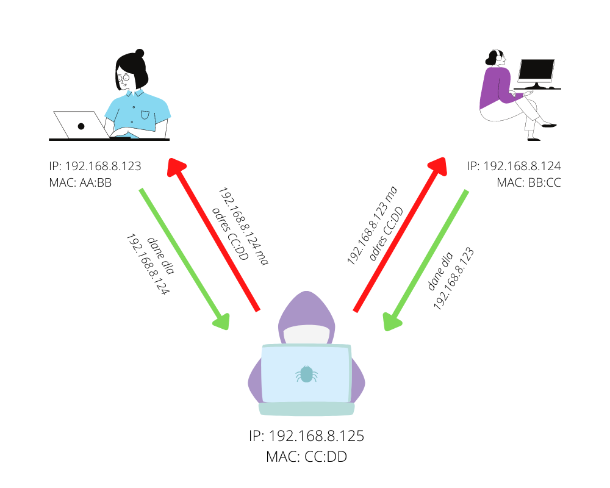

# Odwzorowanie adresów IPv4

**Przydatne linki**
- [dr inż. Maciej Sobieraj - Sieci komputerowe Wykład 2](http://maciej.sobieraj.pracownik.put.poznan.pl/PWSZ/W02.pdf)
- [Jarosław Piersa - ARP oraz RARP](https://www-users.mat.umk.pl/~piersaj/www/contents/wss/arp.pdf)
- [Pasja informatyki - Protokół ARP](https://pasja-informatyki.pl/sieci-komputerowe/protokol-arp/)
- [Wikipedia - Address Resolution Protocol](https://en.wikipedia.org/wiki/Address_Resolution_Protocol)

**Spis treści**
- [Odwzorowanie adresów IPv4](#odwzorowanie-adresów-ipv4)
  - [Rola adresów fizycznych w wysyłaniu ramek](#rola-adresów-fizycznych-w-wysyłaniu-ramek)
  - [Address Resolution Protocol](#address-resolution-protocol)
    - [Działanie ARP](#działanie-arp)
      - [ARP request](#arp-request)
      - [ARP reply](#arp-reply)
    - [Tablica ARP](#tablica-arp)
    - [Struktura nagłówka ARP](#struktura-nagłówka-arp)
  - [ARP Cache Poisoning](#arp-cache-poisoning)

## Rola adresów fizycznych w wysyłaniu ramek

Załóżmy, że chcemy pingować adres 192.168.8.123 w sieci przełączanej Ethernet. Pamiętając o modelu warstwowym OSI spróbujmy sobie wyobrazić jak ten proces będzie wyglądać:

- zostanie utworzony nagłówek ICMP
- zostanie dodany nagłówek IPv4 zawierający m. in. adres docelowy hosta
- zostanie dodany nagłówek Ethernet wraz z adresem fizycznym hosta docelowego (lub bramy domyślnej, jeśli host znajduje się w innej sieci)

Tak więc, aby wysłać taki pakiet potrzebujemy dwóch adresów docelowego hosta - adres logiczny IPv4 oraz adres fizyczny MAC. Adres IP oczywiście mamy, ale jak zdobyć adres MAC? Bez niego wysłanie ramki jest niemożliwe (jak przełącznik przekaże ramkę bez adresu?)

## Address Resolution Protocol

Rozwiązaniem tego problemu jest protokół ARP, który mapuje adresy logiczne IPv4 na adresy fizyczne MAC

### Działanie ARP

#### ARP request

W celu ustalenia adresu MAC o danym adresie IPv4 najpierw zostaje wysłane zapytanie ARP na rozgłoszeniowy adres MAC `ff:ff:ff:ff:ff:ff` - *powiedzcie mi, kto ma adres IP 192.168.8.123?*

#### ARP reply

Na wiadomość odpowiada tylko host, który posiada adres IP, o który jest zapytanie, zapamiętując adres MAC nadawcy w swojej tablicy ARP i wysyłając odpowiedź wraz z swoim adresem MAC - *to ja, mój adres MAC to XX:XX:XX:XX:XX:XX*

### Tablica ARP

Żeby nie pytać się za każdym razem o adres MAC, host zapisuje adresy fizyczne innych urządzeń w sieci w swojej pamięci podręcznej (*cache*). Można ją wyświetlić za pomocą polecenia `arp -a`

### Struktura nagłówka ARP

```c
/* struktura naglowka ARP */
struct arpheader {
    u_int16_t htype;    // Hardware type
    u_int16_t ptype;    // Protocol type
    u_char hlen;        // Hardware address length
    u_char plen;        // Protocol address length 
    u_int16_t oper;     // Operation
    u_char sha[6];      // Sender hardware address
    u_char spa[4];      // Sender protocol address
    u_char tha[6];      // Target hardware address
    u_char tpa[4];      // Target protocol address
};
```

Pole OPER przyjmuje wartość 1 dla zapytania (*request*) lub wartość 2 dla odpowiedzi (*reply*)

## ARP Cache Poisoning

Protokół ARP można wykorzystać do przeprowadzenia ataku typu *man in the middle* polegającego na zatruciu tablicy ARP dwóch urządzeń i przechwytywaniu ruchu między nimi.

Atakujący wysyła *gratisowe* odpowiedzi ARP ze swoim adresem MAC i adresem IP ofiary, dzięki czemy może przechwytywać przeznaczone dla niej pakiety

