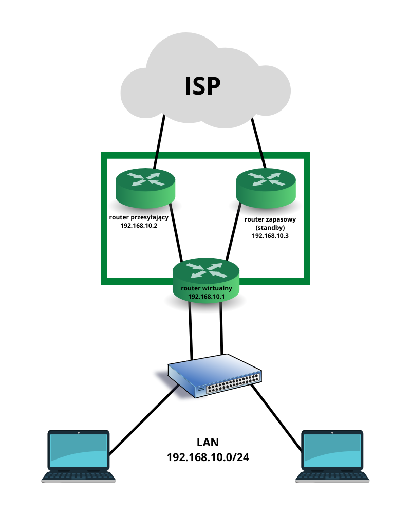

# Redundancja routera pierwszego przeskoku - FHRP

**Przydatne link**

- [Na Styku Sieci - FHRP – wszystko co musisz wiedzieć o redundancji bramy domyślnej](https://www.nastykusieci.pl/fhrp-wszystko-co-musisz-wiedziec-o-redundancji-bramy-domyslnej/)
- [Inna Sieć - Protokoły FHRP – HSRP, VRRP i GLBP](https://innasiec.pl/protokoly-fhrp-hsrp-vrrp-i-glbp/)
- [Na Styku Sieci - Redundancja HSRP](https://www.nastykusieci.pl/ccnp-300-115-hsrp/)
- [NetAdminPro - Wykorzystanie protokołu HSRP](https://netadminpro.pl/konfiguracja-protokolu-hsrp/)
- [CertBros - First Hop Redundancy Protocol Explained | Cisco CCNA 200-301](https://www.youtube.com/watch?v=CtZ81OvJxlI)
- [Jeremy's IT Lab - Free CCNA | First Hop Redundancy Protocols | Day 29 | CCNA 200-301 Complete Course](https://www.youtube.com/watch?v=43WnpwQMolo)

**Spis treści**

- [Redundancja routera pierwszego przeskoku - FHRP](#redundancja-routera-pierwszego-przeskoku---fhrp)
  - [Po co jest FHRP?](#po-co-jest-fhrp)
  - [Router wirtualny](#router-wirtualny)
  - [Różne wersje FHRP](#różne-wersje-fhrp)
  - [HSRP](#hsrp)
    - [Opcja preempt](#opcja-preempt)
    - [Stany HSRP](#stany-hsrp)
    - [Przykład konfiguracji na routerze Cisco](#przykład-konfiguracji-na-routerze-cisco)

## Po co jest FHRP?

Jak wiemy, redundancja w sieciach komputerowych jest pożądana. Dzięki dodatkowym połączeniom, w przypadku awarii jednego z nich, sieć działa nieprzerwanie. Podobnie jest w przypadku routerów.

Gdy router (brama domyślna) lub jego port ulegną awarii, urządzenia w obrębie podłączonej do niego sieci nie mogą komunikować się z urzadzeniami znajdującymi się w innych sieciach, np. stracą dostęp do Internetu.

W celu uniknięcia takiej sytuacji opracowano protokoły *zwielokrotnienia routera pierwszego przeskoku* (*first hop redundancy protocol*)

## Router wirtualny

Protokoły FHRP, w celu uniknięcia występowania pojedynczego punktu awarii bramy domyślnej, implementują *router wirtualny*, który jest grupą routerów współdzielących adresy IP i MAC, które są adresami bramy domyślnej, udając jedno urządzenie fizyczne.



Jeden router działa jako przesyłający (aktywny), natomiast drugi działa w trybie *standby*. W przypadku awarii routera przesyłającego, router standby przejmuje jego rolę i staje się routerem aktywnym. Urządzenia końcowe nie zauważają żadnej zmiany, ponieważ adresy IP i MAC bramy domyślnej nie zmieniły się (ponieważ są adresami routera wirtualnego)

## Różne wersje FHRP

- **Hot Standby Router Protocol (HSRP)**
  - protokół zastrzeżony przez firmę Cisco
  - jest też wersja dla IPv6
- **Virtual Router Redundancy Protocol v2 (VRRPv2)**
  - otwarty standard
- **VRRPv3**
  - zapewnia obsługę IPv4 i IPv6
  - lepiej skalowalny niż poprzednik
- **Gateway Load Balancing Protocol (GLBP)**
  - protokół zastrzeżony przez Cisco
  - zapewnia równoważenie obciążenia
  - istnieje również wersja dla IPv6
- **ICMP Router Discovery Protocol (IRDP)**
  - RFC 1256
  - jest rozwiązaniem starszym
  - pozwala urządzeniom na znalezienie routerów IPv4, które zapewniają łączność do innych sieci

## HSRP

Routery wybierają wśród siebie routery *active* i *standby* w procesie elekcji. Router z najwyższym priorytetem (domyślnie 100) staje się routerem przesyłającym. W przypadku, gdy routery mają równe priorytety, routerem aktywnym zostaje urządzenie z *najwyższym* adresem IP. Priorytet można zmienić korzystając z polecenia `standby prioroty <num>` trybu konfiguracji interfejsu. Jego wartość należy do zakresu 0 - 255.

### Opcja preempt

Domyśnie, router wybrany jako przesyłający, pozostanie nim tak długo, jak działa, nawet w przypadku pojawienia się routera z wyższym priorytetem. Opcja **preempt** pozwala routerowi na uruchomieniu procesu reelekcji, przez co na nowo są wybierane routery przesyłający i standby.

### Stany HSRP

- **initial**
  - router jest w tym stanie w przypadku, gdy interfejs staje się dostępny lub zmieniła się konfiguracja urządzenia
- **learn**
  - router nie otrzymał komunikatów **hello** od routera aktywnego
  - router nie określił wirtualnego adresu IP
  - czeka na komunikat **hello** od aktywnego routera
- **listen**
  - router zna wirtualny adres IP
  - nie jest routerem aktywnym ani standby
  - nasłuchuje komunikatów **hello** od tych routerów
- **speak**
  - router okresowo wysyła **hello**
  - aktywnie uczestniczy w procesie elekcji
- **standby**
  - router jest kandydatem na następny router aktywny
  - okresowo wysyła komunikaty **hello**
  - jeśli przez 10 sekund nie odbierze komunikatu **hello** od aktywnego routera, przejmuje jego rolę

Domyślnie, routery aktywny i standby wysyłają na adres multicastowy do grupy HSRP komunikaty hello co 3 sekundy

### Przykład konfiguracji na routerze Cisco

```
Router(config)#interface g0/0/0
Router(config-if)#standby version 2
Router(config-if)#
%HSRP-6-STATECHANGE: GigabitEthernet0/0/0 Grp 0 state Init -> Init

Router(config-if)#standby 1 ip 192.168.10.1
% Warning: address is not within a subnet on this interface
Router(config-if)#
%HSRP-6-STATECHANGE: GigabitEthernet0/0/0 Grp 1 state Init -> Init

Router(config-if)#standby 1 priority 169
Router(config-if)#standby 1 preempt
Router(config-if)#
%HSRP-6-STATECHANGE: GigabitEthernet0/0/0 Grp 1 state Speak -> Standby

%HSRP-6-STATECHANGE: GigabitEthernet0/0/0 Grp 1 state Standby -> Active

Router(config-if)#
```

Na routerze może istnieć wiele instancji protokołu HSRP, dlatego należy określić grupę, jaką konfigurujemy (w tym przypadku 1) - ta liczba musi być taka sama na wszystkich routerach w grupie.

Określony adres IP jest wirtualnym adresem routera

```
Router#show standby
GigabitEthernet0/0/0 - Group 1 (version 2)
  State is Active
    6 state changes, last state change 00:00:26
  Virtual IP address is 192.168.10.1
  Active virtual MAC address is 0000.0C9F.F001
    Local virtual MAC address is 0000.0C9F.F001 (v2 default)
  Hello time 3 sec, hold time 10 sec
    Next hello sent in 1.481 secs
  Preemption enabled
  Active router is local
  Standby router is unknown
  Priority 169 (configured 169)
  Group name is hsrp-Gig0/0/0-1 (default)
Router#
```

```
Router#show standby brief
                     P indicates configured to preempt.
                     |
Interface   Grp  Pri P State    Active          Standby         Virtual IP
Gig0/0/0    1    169 P Active   local           unknown         192.168.10.1   
Router#
```