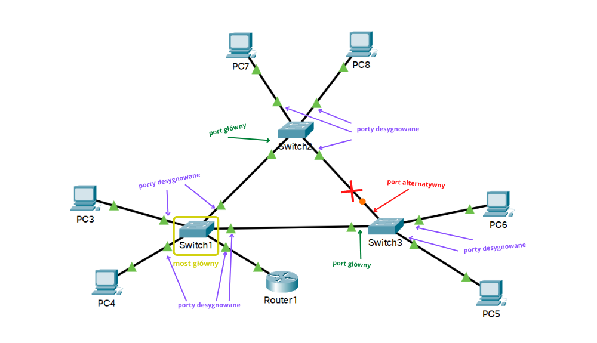

# Spanning Tree Protocol

**Przydatne linki**
- [dr inż. Maciej Sobieraj - Scaling Networks (Skalowanie sieci)](http://maciej.sobieraj.pracownik.put.poznan.pl/W06_TAPS.pdf)
- [Cisco - Understand and Configure STP on Catalyst Switches](https://www.cisco.com/c/en/us/support/docs/lan-switching/spanning-tree-protocol/5234-5.html)
- [Na Styku Sieci - Wprowadzenie do Spanning Tree Protocol (STP)](https://www.nastykusieci.pl/stp-wprowadzenie/)
- [TechTarget - Spanning Tree Protocol (STP)](https://www.techtarget.com/searchnetworking/definition/spanning-tree-protocol)
- [Neso Academy - Spanning Tree Protocol (STP)](https://www.youtube.com/watch?v=GSKoQ8ZR8rw)

**Spis treści**
- [Spanning Tree Protocol](#spanning-tree-protocol)
  - [Czym i po co jest STP?](#czym-i-po-co-jest-stp)
  - [Jak działa STP?](#jak-działa-stp)
    - [STA](#sta)
    - [Elekcja mostu głównego](#elekcja-mostu-głównego)
      - [Priorytet mostu (BID)](#priorytet-mostu-bid)
      - [Rozszerzony identyfikator systemu](#rozszerzony-identyfikator-systemu)
      - [Adres MAC](#adres-mac)
    - [Koszt ścieżki głównej](#koszt-ścieżki-głównej)
    - [Porty główne, desygnowane i zablokowane](#porty-główne-desygnowane-i-zablokowane)
    - [Liczniki czasu](#liczniki-czasu)
    - [Stany portów](#stany-portów)
  - [Per-VLAN Spanning Tree](#per-vlan-spanning-tree)
  - [Różne wersje protokołu STP](#różne-wersje-protokołu-stp)
  - [RSTP](#rstp)
    - [STP vs RSTP](#stp-vs-rstp)
      - [Stany portów](#stany-portów-1)
      - [Role portów](#role-portów)
  - [PortFast i BPDU Guard](#portfast-i-bpdu-guard)

## Czym i po co jest STP?

Mamy przykładową sieć z nadmiarowymi łączami


Rozważmy sytuację, co się stanie jeśli PC3 zdecyduje się pingować adres *broadcast* sieci, czyli wszystkie hosty? Albo protokół ARP wyśle zapytanie na adres rozgłoszeniowy? Przełącznik odbierając ramkę rozgłoszeniową, przekaże ją na wszystkie porty. Pozostałe dwa przełączniki również przekażą ramkę na wszystkie porty. Pierwszy przełącznik ponownie otrzyma tą samą ramkę rozgłoszeniową i ponownie przekaże ją na wszystkie porty


Powstanie pętla w warstwie drugiej i ramki będą krążyć po sieci w kółko


Ruch rozgłoszeniowy skutecznie obciąży sieć, ilość ramek jest przytłaczająca i sieć nie jest w stanie tego wytrzymać


W takiej sytuacji sieć może stać się bezużyteczna w ciągu zaledwie kilku sekund. Nazywa się to *burzą rozgłoszeń* (*broadcast storm*).

Protokół *Spanning Tree Protocol* jest po to, aby nie doszło do czegoś takiego. Blokuje nadmiarowe łącza przeciwdziałając pętlą warstwy drugiej. Można pomyśleć - czy nie wystarczy usunąć te nadmiarowe łącza? W końcu STP sprawia, że są nieużywane. Redundancja w sieciach komputerowych jest bardzo ważna, jeśli jedno łącze padnie, drugie sprawi, że sieć będzie działać nieprzerwanie. STP dba o to, ponieważ jeśli używane łącze zostanie przerwane w wynniku awarii, protokół odblokuje dotychczas blokowane łącze.

## Jak działa STP?

### STA

STP wykorzystuje opracowany przez [Radię Perlman](https://en.wikipedia.org/wiki/Radia_Perlman) *algorytm [drzewa rozpinającego](https://techvidvan.com/tutorials/spanning-tree/)* (*[spanning tree](https://techvidvan.com/tutorials/spanning-tree/) algorithm*). Na początku przełączniki wybierają wśród siebie ***most główny***, który będzie stanowić punkt odniesienia dla dalszych obliczeń. Każdy z pozostałych przełączników wybiera ***port główny***, który wyznacza ścieżkę o najmniejszym koszcie do mostu głównego (koszt odnosi się do szerokości pasma). Port główny to najlepszy port do wysyłania ruchu w kierunku mostu głównego (port najbliżej mostu głównego). W następnej kolejności przełączniki wybierają ***porty desygnowane***. Port desygnowany to najlepszy port do odbierania ruchu od drugiego przełącznika, który jest kierowany do mostu głównego. Pozostałe porty stają się portami zablokowanymi (inaczej alternatywnymi lub zapasowymi). W przypadku awarii łącza, wznawiane są obliczenia STP

### Elekcja mostu głównego

Podczas działania protokołu przełączniki wymieniają się nawzajem informacjami o sobie przy użyciu *Bridge Protocol Data Units* (BPDU). Informacje zawarte w BPDU służą do wyboru mostu głównego, portów głównych i desygnowanych.

BPDU zawiera pola:
- priorytet mostu (4 bity)
- rozszerzony ID systemu (12 bitów)
- adres MAC (48 bitów)

Wysyłane BPDU zawierają swój własny priorytet mostu (*bridge ID*, BID) oraz priorytet mostu głównego, tzw. Root ID. Na początku wszystkie przełączniki deklarują się jako most główny

#### Priorytet mostu (BID)

Jego wartość zawiera się w przedziale 0 - 61440 i jest wielokrotnością 4096. Preferowany jest niższa wartość priorytetu (jeśli zostanie ustawiony na 0, ma pierwszeństwo nad wszystkimi innymi). Na przełącznikach Cisco domyślna wartość priorytetu mostu wynosi 32768

#### Rozszerzony identyfikator systemu

To pole służy do identyfikacji sieci VLAN dla danego BPDU

#### Adres MAC

Jeśli dwa przełączniki mają ustawiony taki sam BID i rozszerzony identyfikator systemu, niższy adres MAC będzie preferowany (tak jakby przełącznik miał niższy priorytet mostu)

### Koszt ścieżki głównej

Jak już zostanie wybrany most główny dla drzewa rozpinającego, rozpoczyna się ustalanie najlepszych do niego ścieżek z poszczególnych węzłów (w danej domenie rozgłoszeniowej).

BPDU zawiera koszt ścieżki głównej, która jest kosztem ścieżki od przełącznika wysyłającego do mostu głównego. Gdy przełącznik odbierze BPDU, dodaje koszt portu wejścia segmentu, żeby określić jego wewnętrzny koszt ścieżki głównej.

Domyślnie koszty portów są określane na podstawie szybkości ich działania 

szybkość | koszt STP - IEEE 802.1D-1998 | koszt RSTP - IEEE 802.1w-2004
:---: | :---: | :---:
10 Gb/s | 2 | 2000
1 Gb/s | 4 | 20000
100 Mb/s | 19 | 200000
10 Mb/s | 100 | 2000000

Koszty portów można konfigurować

### Porty główne, desygnowane i zablokowane



Wszystkie porty mostu głównego są desygnowane

```
Switch1#show spanning-tree 
VLAN0001
  Spanning tree enabled protocol ieee
  Root ID    Priority    32769
             Address     0001.4252.A0C1
             This bridge is the root
             Hello Time  2 sec  Max Age 20 sec  Forward Delay 15 sec

  Bridge ID  Priority    32769  (priority 32768 sys-id-ext 1)
             Address     0001.4252.A0C1
             Hello Time  2 sec  Max Age 20 sec  Forward Delay 15 sec
             Aging Time  20

Interface        Role Sts Cost      Prio.Nbr Type
---------------- ---- --- --------- -------- --------------------------------
Fa0/1            Desg FWD 19        128.1    P2p
Fa0/2            Desg FWD 19        128.2    P2p
Fa0/4            Desg FWD 19        128.4    P2p
Fa0/3            Desg FWD 19        128.3    P2p
Gi0/1            Desg FWD 4         128.25   P2p

Switch1#
```

```
Switch2#show spanning-tree 
VLAN0001
  Spanning tree enabled protocol ieee
  Root ID    Priority    32769
             Address     0001.4252.A0C1
             Cost        19
             Port        1(FastEthernet0/1)
             Hello Time  2 sec  Max Age 20 sec  Forward Delay 15 sec

  Bridge ID  Priority    32769  (priority 32768 sys-id-ext 1)
             Address     0001.C974.5CA3
             Hello Time  2 sec  Max Age 20 sec  Forward Delay 15 sec
             Aging Time  20

Interface        Role Sts Cost      Prio.Nbr Type
---------------- ---- --- --------- -------- --------------------------------
Fa0/1            Root FWD 19        128.1    P2p
Fa0/2            Desg FWD 19        128.2    P2p
Fa0/3            Desg FWD 19        128.3    P2p
Fa0/4            Desg FWD 19        128.4    P2p

Switch2#
```

```
Switch3#show spanning-tree 
VLAN0001
  Spanning tree enabled protocol ieee
  Root ID    Priority    32769
             Address     0001.4252.A0C1
             Cost        19
             Port        2(FastEthernet0/2)
             Hello Time  2 sec  Max Age 20 sec  Forward Delay 15 sec

  Bridge ID  Priority    32769  (priority 32768 sys-id-ext 1)
             Address     0060.3EE1.566A
             Hello Time  2 sec  Max Age 20 sec  Forward Delay 15 sec
             Aging Time  20

Interface        Role Sts Cost      Prio.Nbr Type
---------------- ---- --- --------- -------- --------------------------------
Fa0/2            Root FWD 19        128.2    P2p
Fa0/1            Altn BLK 19        128.1    P2p
Fa0/4            Desg FWD 19        128.4    P2p
Fa0/3            Desg FWD 19        128.3    P2p

Switch3#
```

### Liczniki czasu

- **Hello Timer** 
  - odstęp między kolejnymi BPDU
  -  może być ustawiony w zakresie 1 - 10 sekund 
  -  domyślnie 2 sekundy
- **Forward Delay Timer**
  - czas, przez który port jest w stanie nasłuchiwania i uczenia
  - może być ustawiany w zakresie 4 - 30 sekund
  - domyślnie 15 sekund
- **Max Age Timer**
  - maksymalny czas, przez który przełącznik czeka, zanim spróbuje zmienić topologię STP
  - może być ustawiany w zakresie 1 - 10 sekund
  - domyślnie 2 sekundy

### Stany portów

stan portu | BPDU | aktualizacja tablicy adresów MAC | przekazywanie ramek
:--- | :---: | :---: | :---:
**blokowanie** | tylko odbieranie | nie | nie
**nasłuchiwanie** | odbieranie i wysyłanie | nie | nie
**uczenie** | odbieranie i wysyłanie | tak | nie
**przekazywanie** | odbieranie i wysyłanie | tak | tak
**wyłączony** | nie odbiera i nie wysyła | nie | nie

## Per-VLAN Spanning Tree

We wczesnych wersjach protokół STP nie był przemyślany dla środowiska z wieloma sieciami VLAN - była tylko jedna instancja drzewa rozpinającego dla całej sieci przełączanej. W nowszych implementacjach protokół STP można skonfigurować do pracy z wieloma sieciami VLAN. Jeśli w sieci istnieje wiele sieci VLAN, dla każdej jest tworzona instancja drzewa rozpinającego, wybierany jest most główny, etc.

## Różne wersje protokołu STP

Istnieją różne odmiany protokołu STP:

- **STP**
  - oryginalna wersja 802.1D
  - zwany także Common Spanning Tree (CST)
  - jedna instancja drzewa rozpinającego, niezależnie od liczby sieci VLAN
- **PVST+**
  - Per-VLAN Spanning Tree
  - ulepszona przez Cisco wersja STP
  - osobna instancja drzewa rozpinającego dla każdej sieci VLAN
  - obsługuje:
    - PortFast
    - UplinkFast
    - BackboneFast
    - BPDU guard
    - BPDU filter
    - root guard
    - loop guard
- **RSTP**
  - *Rapid Spanning Tree Protocol*
  - IEEE 802.1w
  - szybsza konwergencja niż w przypadku STP
- **Rapid PVST+**
  - ulepszona przez Cisco wersja RSTP
  - osobna instancja drzewa rozpinającego dla każdej sieci VLAN
  - obsługuje to co PVST+
- **MSTP**
  - *Multiple Spanning Tree Protocol*
  - pozwala na przypisanie wielu sieci VLAN do jednej instancji drzewa rozpinającego
- **MST**
  - *Multiple Spanning Tree*
  - implementacja Cisco protokołu MSTP
  - zapewnia do 16 instancji RSTP
  - obsługuje to co PVST+

## RSTP

RSTP przyspiesza ponowne obliczanie drzewa rozpinającego w przypadku zmiany topologii sieci. Jeśli port jest skonfigurowany jako alternatywny, może przejść bezpośrednio do stanu przekazywania

### STP vs RSTP

#### Stany portów

<style type="text/css">
.tg  {border-collapse:collapse;border-spacing:0;}
.tg td{border-color:black;border-style:solid;border-width:1px;font-family:Arial, sans-serif;font-size:14px;
  overflow:hidden;padding:10px 5px;word-break:normal;}
.tg th{border-color:black;border-style:solid;border-width:1px;font-family:Arial, sans-serif;font-size:14px;
  font-weight:normal;overflow:hidden;padding:10px 5px;word-break:normal;}
.tg .tg-baqh{text-align:center;vertical-align:top}
.tg .tg-nrix{text-align:center;vertical-align:middle}
</style>
<table class="tg">
<thead>
  <tr>
    <th class="tg-baqh"><span style="font-weight:bold">STP</span></th>
    <th class="tg-baqh"><span style="font-weight:bold">RSTP</span></th>
  </tr>
</thead>
<tbody>
  <tr>
    <td class="tg-baqh">wyłączony</td>
    <td class="tg-nrix" rowspan="3">odrzucanie</td>
  </tr>
  <tr>
    <td class="tg-baqh">blokowanie</td>
  </tr>
  <tr>
    <td class="tg-baqh">nasłuchiwanie</td>
  </tr>
  <tr>
    <td class="tg-baqh">uczenie</td>
    <td class="tg-baqh">uczenie</td>
  </tr>
  <tr>
    <td class="tg-baqh">przekazywanie</td>
    <td class="tg-baqh">przekazywanie</td>
  </tr>
</tbody>
</table>

#### Role portów

<style type="text/css">
.tg  {border-collapse:collapse;border-spacing:0;}
.tg td{border-color:black;border-style:solid;border-width:1px;font-family:Arial, sans-serif;font-size:14px;
  overflow:hidden;padding:10px 5px;word-break:normal;}
.tg th{border-color:black;border-style:solid;border-width:1px;font-family:Arial, sans-serif;font-size:14px;
  font-weight:normal;overflow:hidden;padding:10px 5px;word-break:normal;}
.tg .tg-baqh{text-align:center;vertical-align:top}
.tg .tg-amwm{font-weight:bold;text-align:center;vertical-align:top}
.tg .tg-nrix{text-align:center;vertical-align:middle}
</style>
<table class="tg">
<thead>
  <tr>
    <th class="tg-amwm">STP</th>
    <th class="tg-amwm">RSTP</th>
  </tr>
</thead>
<tbody>
  <tr>
    <td class="tg-baqh">główny</td>
    <td class="tg-baqh">główny</td>
  </tr>
  <tr>
    <td class="tg-baqh">desygnowany</td>
    <td class="tg-baqh">desygnowany</td>
  </tr>
  <tr>
    <td class="tg-nrix" rowspan="2">zablokowany</td>
    <td class="tg-baqh">zapasowy</td>
  </tr>
  <tr>
    <td class="tg-baqh">alternatywny</td>
  </tr>
</tbody>
</table>

Port alternatywny stanowi alternatywną ścieżkę do mostu głównego. Port zapasowy występuje w pzrypadku wykorzystania medium współdzielonego, np. koncentratora, z tego wględu występuje rzadziej, ponieważ koncentrator jest urządzeniem przestarzałym

## PortFast i BPDU Guard

**PortFast** pozwala na natychmiastową zmianę stanu portu z zablokowanego do przekazywania pomijając fazy nasłuchiwania i uczenia. PortFast powinien być stosowany wyłącznie w przypadku portów dostępowych, do których podłączone są urządzenia końcowe, żeby mogły uzyskać natychmiastowy dostęp do sieci. PortFast na porcie z drugim przełącznikiem powoduje ryzyko powstania pętli. Jeśli jednak wystąpiłaby taka sytuacja, przełączniki Cisco posiadają funkcję **BPDU guard**. Po jej włączeniu, jeśli port odbierze jakiekolwiek BPDU, zostanie umieszczony w stanie *errdisabled* (wyłączony w wyniku błędu), co chroni przed powstawaniem potencjalnych pętli
