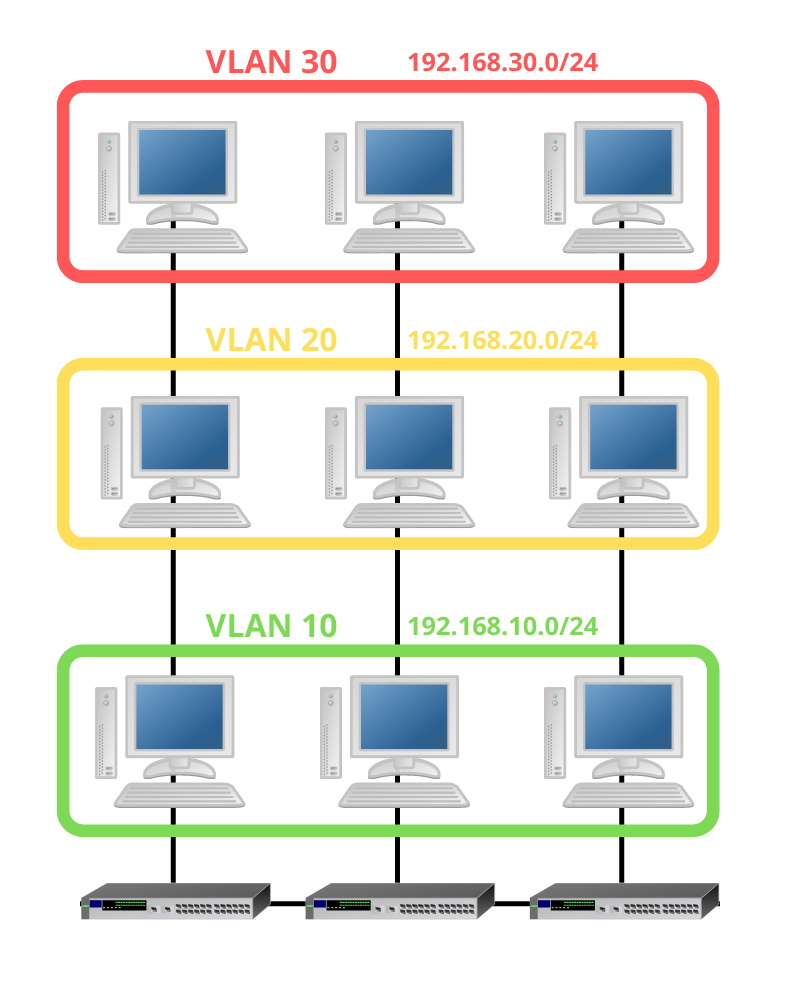
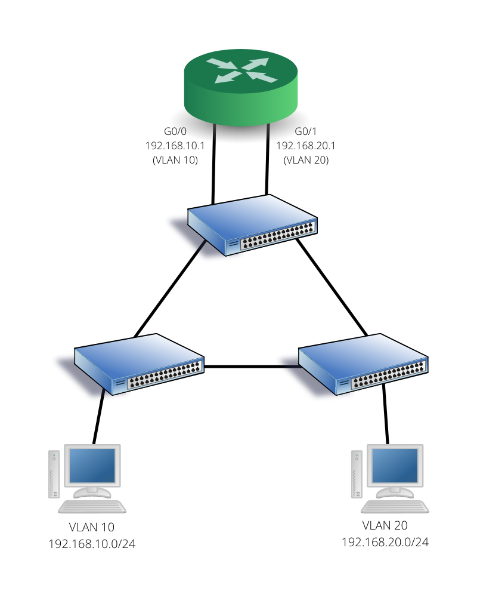
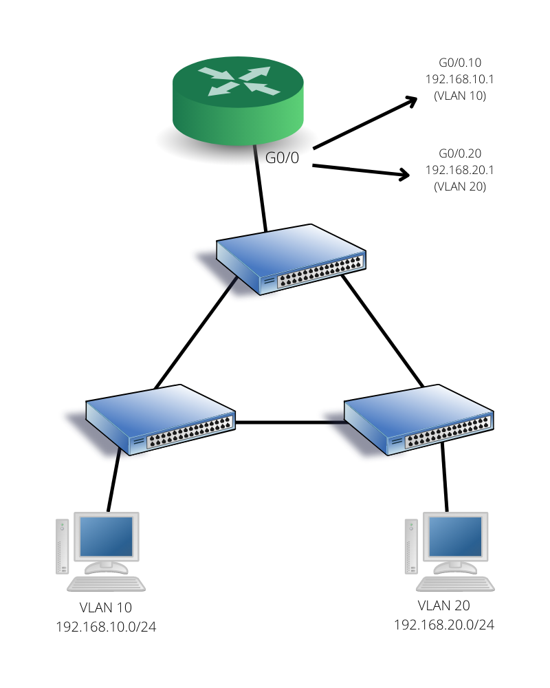
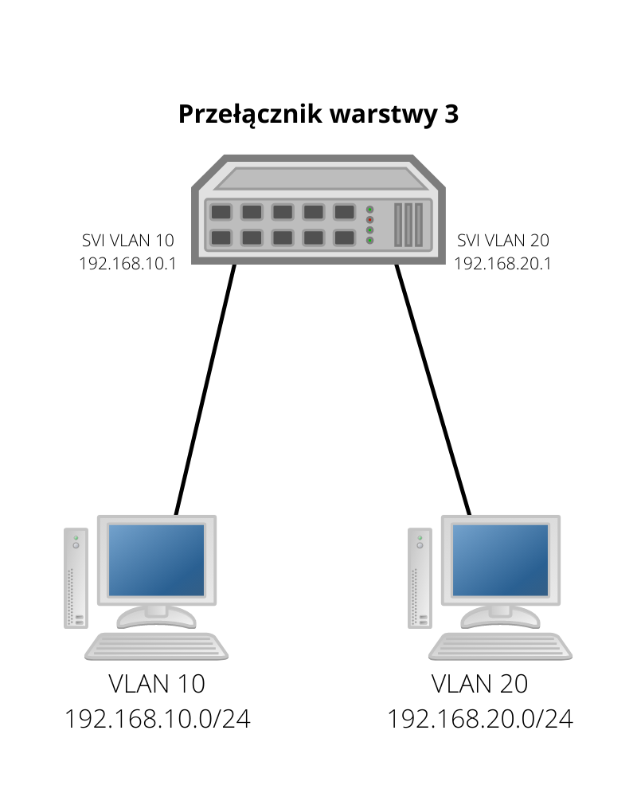
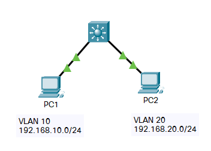
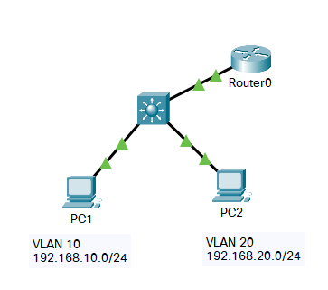

# Sieci VLAN

**Przydatne linki**
- [dr inż. Maciej Sobieraj - Rozdział 6: Sieci VLAN](http://maciej.sobieraj.pracownik.put.poznan.pl/W04_TAPS.pdf)
- [dr inż. Maciej Sobieraj - Przełączniki](http://maciej.sobieraj.pracownik.put.poznan.pl/W03_TAPS.pdf)
- [Network Engineer Academy - CCNA | What's a VLAN PART 1. DETAIL EXPLANATION with LAB. MUST WATCH.](https://www.youtube.com/watch?v=jJYluxDgz3A)

**Spis treści**
- [Sieci VLAN](#sieci-vlan)
  - [Czym są sieci VLAN?](#czym-są-sieci-vlan)
  - [Korzyści z wykorzystywania sieci VLAN](#korzyści-z-wykorzystywania-sieci-vlan)
  - [Typy sieci VLAN](#typy-sieci-vlan)
    - [Domyślny](#domyślny)
    - [Danych](#danych)
    - [Natywny](#natywny)
    - [Zarządzania](#zarządzania)
    - [Głosowy](#głosowy)
  - [Sieci VLAN w infrastrukturze z wieloma przełącznikami](#sieci-vlan-w-infrastrukturze-z-wieloma-przełącznikami)
    - [Magistrale VLAN](#magistrale-vlan)
    - [Znaczniki sieci VLAN](#znaczniki-sieci-vlan)
  - [Zakresy sieci VLAN](#zakresy-sieci-vlan)
    - [Cechy sieci VLAN o normalnym zakresie](#cechy-sieci-vlan-o-normalnym-zakresie)
    - [Cechy sieci VLAN o rozszerzonym zakresie](#cechy-sieci-vlan-o-rozszerzonym-zakresie)
  - [Konfigurowanie sieci VLAN](#konfigurowanie-sieci-vlan)
    - [Tworzenie sieci VLAN](#tworzenie-sieci-vlan)
    - [Przypisywanie portów do sieci VLAN](#przypisywanie-portów-do-sieci-vlan)
    - [VLAN dla głosu](#vlan-dla-głosu)
    - [Polecenie `show` dla sieci VLAN](#polecenie-show-dla-sieci-vlan)
      - [`show vlan brief`](#show-vlan-brief)
      - [`show vlan id <vlan id>`](#show-vlan-id-vlan-id)
      - [`show vlan name <vlan name>`](#show-vlan-name-vlan-name)
      - [`show interfaces <if id> switchport`](#show-interfaces-if-id-switchport)
    - [Usuwanie sieci VLAN](#usuwanie-sieci-vlan)
  - [Konfiguracja połączeń trunk](#konfiguracja-połączeń-trunk)
  - [Dynamic Trunk Protocol](#dynamic-trunk-protocol)
  - [Routing między sieciami VLAN](#routing-między-sieciami-vlan)
    - [Tradycyjny routing między sieciami VLAN](#tradycyjny-routing-między-sieciami-vlan)
    - [*Router na patyku*](#router-na-patyku)
    - [Routing między sieciami VLAN z wykorzystaniem przełącznika warstwy 3](#routing-między-sieciami-vlan-z-wykorzystaniem-przełącznika-warstwy-3)
      - [Konfiguracja routingu na przełączniku wielowarstwowym](#konfiguracja-routingu-na-przełączniku-wielowarstwowym)
      - [Konfiguracja portu routującego](#konfiguracja-portu-routującego)

## Czym są sieci VLAN?

Sieci VLAN (*virtual local area network*), czyli wirtualne sieci LAN, w odróżnieniu od zwykłych sieci lokalnych bazują na połączeniach logicznych, a nie fizycznych. Urządzenia w ramach jednej sieci VLAN komunikują się ze sobą, jakby były podłączone do tego samego fizycznego przełącznika, podczas gdy w rzeczywistości mogą być rozmieszczone w różnych częściach budynku lub kampusu i podłączone do różnych przełączników. Każda sieć VLAN stanowi sieć IP i posiada swój adres sieci IP



Dzięki sieciom VLAN można segmentować sieć ze względu na czynniki takie jak funkcje urządzeń, zespół ludzi z nich korzystających czy wykorzystywane aplikacje, bez względu na faktyczne rozmieszczemie urządzeń

## Korzyści z wykorzystywania sieci VLAN

- **mniejsze domeny rozgłoszeniowe** - ruch broadcast i multicast dociera tylko do urządzeń w tej samej sieci VLAN, bez względu na współdzieloną fizyczną infrastrukturę
- **lepsza wydajność** - mniejsze domeny rozgłoszeniowe zmniejszają ilość niepotrzebnego ruchu w sieci
- **większe bezpieczeństwo** - użytkownicy mogą komunikować się tylko z innymi użytkownikami w tej samej sieci VLAN
- **redukcja kosztów** - sieci VLAN korzystają z istnejącej przepustowości

## Typy sieci VLAN

### Domyślny

Na przełącznikach Cisco domyślny VLAN to VLAN 1 i wszystkie porty przełącznika domyślnie należą do sieci VLAN 1. VLAN zarządzania i natywny VLAN również są domyślnie siecią VLAN 1. Nazwy sieci VLAN 1 nie można zmieniać albo usuwać

### Danych

Sieci VLAN danych są tworzone w celu wydzielenia grup uzytkowników i urządzeń. Są przeznaczone dla ruchu generowanego przez użytkowników. W sieci organizacji może istnieć wiele sieci VLAN danych w zależności od potrzeb.

Ruch głosowy i zarządzania **nie powinien** być dozwolony w sieci VLAN danych

### Natywny

Ruch z sieci VLAN przesyłany z jednego przełącznika do drugiego musi być oznakowany, aby zidentyfikować sieć VLAN, do której należy ramka.

Jednak może istnieć konieczność wysłania nieoznakowanej ramki. Taki ruch jest przesyłany właśnie przez natywny VLAN

### Zarządzania

VLAN zarządzania jest siecią VLAN wydzieloną specjalnie dla ruchu zarządzania siecią (np. SSH) i znajdującymi się w niej urządzeniami

### Głosowy

Dla usługi VoIP (*Voice over IP*) jest wymagana oddzielna sieć VLAN, ponieważ ten ruch wymaga:
 - pierwszeństwa przed innymi typami transmisji w sieci
 - opóźnień (w całej sieci) mniejszych niż 150 ms
 - gwarancji szerokości pasma zapewniającej odpowiednią jakość głosu
 - możliwości przekierowania z pominięciem zatorów w sieci

## Sieci VLAN w infrastrukturze z wieloma przełącznikami

### Magistrale VLAN

Magistrala VLAN (*trunk*) to ethernetowe połączenie *punkt-punkt* między ethernetowym interfejsem przełącznika a ethernetowym interfejsem drugiego urządzenia sieciowego, takiego jak inny przełącznik lub router, które przenosi ruch z wielu sieci VLAN.

Trunki (nie chodzi o alkohol) nie należą do określonej sieci VLAN. Pozwalają propagować cały ruch VLAN między przełącznikami, dzięki czemu urządzenia, które należą do jednej sieci VLAN, ale są podłączone do różnych przełączników, mogą się ze sobą komunikować bez przechodzenia przez router

### Znaczniki sieci VLAN

Żeby przełączniki, które odebrały ramkę na łączu trunk, muszą ją jakoś zidentyfikować, aby wiedzieć, do jakiej sieci VLAN należy. Standard **IEEE 802.1Q** dodaje 4-bajtowy nagłówek pomiędzy źródłowym adresem MAC a polem Typ/Długość.

Pola znacznika VLAN to:

- **Type** - 2 bajty; wartość *tag protocol ID* - TPID (0x8100 dla Ethernet)
- **priorytet użytkownika** - 3 bity
- **Canonical Format Identifier (CFI)** - 1 bit; umożliwia przenoszenie ramek *Token Ring* przez Ethernet
- **VLAN ID (VID)** - 12 bitów; numer identyfikacyjny VLAN

Po wstawieniu znacznika do ramki, przełącznik ponownie oblicza jej FCS.

Jeśli port trunk w natywnej sieci VLAN odbierze oznakowaną ramkę - odrzuci ją, poonieważ natywny VLAN jest przeznaczony dla ruchu ramek nieoznakowanych

## Zakresy sieci VLAN

### Cechy sieci VLAN o normalnym zakresie

- ich VLAN ID zawiera się w przedziale 1 - 1005
- są stosowane w małych i średnich sieciach biznesów i korporacji
- ID od 1002 do 1005 są zarezerwowane dla starszych technologii sieciowych (*Token Ring*, *Fibre Distributed Data Interface*)
- ID o numerach 1 i 1002 - 1005 są tworzone automatycznie i nie można ich usunąć
- konfiguracje są przechowywane w pamięci flash w pliku bazy danych `vlan.dat`
- po skonfigurowaniu, protokół *VLAN Trunking Protocol* (VTP) pomaga w synchronizacji bazy danych VLAN między przełącznikami

### Cechy sieci VLAN o rozszerzonym zakresie

- ich VLAN ID zawiera się w przedziale 1006 - 4094
- są wykorzystywane w sieciach globalnych przedsiębiorstw na tyle dużych, aby potrzebować rozszerzonego zakresu VLAN
- konfiguracje są domyślnie przechowywane w konfiguracji bieżącej
- obsługują mniej funkcji niż VLAN o normalnym zakresie
- wymaga konfiguracji *trybu transparentnego VTP* do obsługi sieci VLAN z rozszerzonym zakresem

## Konfigurowanie sieci VLAN

### Tworzenie sieci VLAN

```
Switch>enable
Switch#configure terminal
Enter configuration commands, one per line.  End with CNTL/Z.
Switch(config)#vlan 10
Switch(config-vlan)#name Teachers
Switch(config-vlan)#end
Switch#
```

### Przypisywanie portów do sieci VLAN

```
Switch(config)#interface fa0/1
Switch(config-if)#switchport mode access
Switch(config-if)#switchport access vlan 10
Switch(config-if)#
```

### VLAN dla głosu

Ruch z sieci VLAN dla głosu musi być znakowany odpowiednią wartością priorytetu klasy usług (CoS) warstwy drugiej

```
Switch(config)#vlan 200
Switch(config-vlan)#name Voice
Switch(config-vlan)#exit
Switch(config)#interface fa0/20
Switch(config-if)#switchport mode access
Switch(config-if)#switchport access vlan 10
Switch(config-if)#mls qos trust cos
Switch(config-if)#switchport voice vlan 200
Switch(config-if)#end
Switch#
```

### Polecenie `show` dla sieci VLAN

#### `show vlan brief`

```
Switch#show vlan brief 

VLAN Name                             Status    Ports
---- -------------------------------- --------- -------------------------------
1    default                          active    Fa0/2, Fa0/3, Fa0/4, Fa0/5
                                                Fa0/6, Fa0/7, Fa0/8, Fa0/9
                                                Fa0/10, Fa0/11, Fa0/12, Fa0/13
                                                Fa0/14, Fa0/15, Fa0/16, Fa0/17
                                                Fa0/18, Fa0/19, Fa0/20, Fa0/21
                                                Fa0/22, Fa0/23, Fa0/24, Gig0/1
                                                Gig0/2
10   Teachers                         active    Fa0/1
200  Voice                            active    Fa0/20
1002 fddi-default                     active    
1003 token-ring-default               active    
1004 fddinet-default                  active    
1005 trnet-default                    active    
Switch#
```

#### `show vlan id <vlan id>`

```
Switch#show vlan id 10

VLAN Name                             Status    Ports
---- -------------------------------- --------- -------------------------------
10   Teachers                         active    Fa0/1

VLAN Type  SAID       MTU   Parent RingNo BridgeNo Stp  BrdgMode Trans1 Trans2
---- ----- ---------- ----- ------ ------ -------- ---- -------- ------ ------
10   enet  100010     1500  -      -      -        -    -        0      0

Switch#
```

#### `show vlan name <vlan name>`

```
Switch#show vlan name Teachers

VLAN Name                             Status    Ports
---- -------------------------------- --------- -------------------------------
10   Teachers                         active    Fa0/1

VLAN Type  SAID       MTU   Parent RingNo BridgeNo Stp  BrdgMode Trans1 Trans2
---- ----- ---------- ----- ------ ------ -------- ---- -------- ------ ------
10   enet  100010     1500  -      -      -        -    -        0      0

Switch#
```

#### `show interfaces <if id> switchport`

```
Switch#show interfaces fa0/1 switchport 
Name: Fa0/1
Switchport: Enabled
Administrative Mode: static access
Operational Mode: down
Administrative Trunking Encapsulation: dot1q
Operational Trunking Encapsulation: native
Negotiation of Trunking: Off
Access Mode VLAN: 10 (Teachers)
Trunking Native Mode VLAN: 1 (default)
Voice VLAN: none
Administrative private-vlan host-association: none
Administrative private-vlan mapping: none
Administrative private-vlan trunk native VLAN: none
Administrative private-vlan trunk encapsulation: dot1q
Administrative private-vlan trunk normal VLANs: none
Administrative private-vlan trunk private VLANs: none
Operational private-vlan: none
Trunking VLANs Enabled: All
Pruning VLANs Enabled: 2-1001
Capture Mode Disabled
Capture VLANs Allowed: ALL
Protected: false
Unknown unicast blocked: disabled
Unknown multicast blocked: disabled
Appliance trust: none


Switch#
```

### Usuwanie sieci VLAN

```
Switch(config)#no vlan 10
Switch(config)#
```

```
Switch#delete vlan.dat
Delete filename [vlan.dat]?
Delete flash:/vlan.dat? [confirm]

Switch#
```

## Konfiguracja połączeń trunk

```
Switch>enable
Switch#configure terminal
Enter configuration commands, one per line.  End with CNTL/Z.
Switch(config)#vlan 99
Switch(config-vlan)#name Native
Switch(config-vlan)#exit
Switch(config)#interface f0/4
Switch(config-if)#switchport mode trunk
Switch(config-if)#switchport trunk native vlan 99
Switch(config-if)#switchport trunk allowed vlan 10,20,99
Switch(config-if)#end
Switch#
```

## Dynamic Trunk Protocol

DTP to zastrzeżony protokół firmy Cisco, domyślnie włączony na przełącznikach z serii Catalyst 2960 i Catalyst 3650. Pozwala on na automatyczną negocjację połączenia trunk między dwoma sąsiednimi urządzeniami.

Aby wyłączyć protokół DTP, należy użyć poleceń:

```
Switch(config-if)#switchport mode trunk 
Switch(config-if)#switchport nonegotiate 
Switch(config-if)#
```

w trybie konfiguracji interfejsu. W tym stanie, port zawsze będzie w trybie trunk. Do ponownego włączenia protokołu DTP służy polecenie

```
Switch(config-if)#switchport mode dynamic auto
```

lub

```
Switch(config-if)#switchport mode dynamic desirable
```

Różnica między tymi dwoma poleceniami polega na tym, że opcja `auto` ustawi interfejs w tryb trunki, jeśli odpowiedni interfejs sąsiedniego urządzenia będzie w trybie `dynamic desirable` lub `trunk`, a ustawi go w tryb dostępowy, jeśli połączony port będzie również w trybie `dynamic auto` lub `access` - wtedy nie nastąpi negocjacja połączenia trunk. Natomiast opcja `desirable` będzie aktywnie próbować negocjować tryb trunk z połączonym portem.

Skutki negocjacji w zależności od ustawionego trybu przedstawia tabela:

Tryb | dynamic auto | dynamic desirable | trunk | access
:---: | :---: | :---: | :---: | :---:
**dynamic auto** | access | trunk | trunk | access
**dynamic desirable** | trunk | trunk | trunk | access
**trunk** | trunk | trunk | trunk | komunikacja będzie ograniczona
**access** | access | access | komunikacja będzie ograniczona | access

## Routing między sieciami VLAN

Urządzenia w sieci VLAN nie mogą się komunikować z urządzeniami w innej sieci VLAN bez urządzenia umożliwiającego routing, takiego jak router lub przełącznik warstwy trzeciej - podobnie jak zwykłe sieci LAN. Są trzy sposoby routingu między sieciami VLAN

### Tradycyjny routing między sieciami VLAN

Jest to rozwiązanie przestarzałe i bardzo źle skalowalne. Polega ono na wykorzystaniu wielu interfejsów Ethernet routera - jeden interfejs na każdą sieć VLAN



### *Router na patyku*

Jest to rozwiązanie lepsze (choć nie najlepsze) idealne dla małych i średnich sieci. Wykorzystuje jeden interfejs fizyczny routera i dzieli go na *podinterfejsy*. Interfejs routera jest skonfigurowany jako magistrala 802.1Q i podłączony do portu trunk przełącznika warstwy drugiej. Podinterfejsy są wirtualnymi interfejsami konfigurowanymi w oprogramowaniu routera.

Każdy podinterfejs jest skonfigurowany z osobnym adresem IP dla każdej sieci VLAN, dzięki czemu routing jest możliwy



Konfiguracja podinterfejsów nie rózni się mocno od zwykłej konfiguracji routera

```
Router(config)#interface g0/0/0.10
Router(config-subif)#encapsulation dot1q 10
Router(config-subif)#ip address 192.168.10.1 255.255.255.0
Router(config-subif)#exit
Router(config)#interface g0/0/0.20
Router(config-subif)#encapsulation dot1q 20
Router(config-subif)#ip address 192.168.20.1 255.255.255.0
Router(config-subif)#exit
Router(config)#interface g0/0/0
Router(config-if)#no shutdown

Router(config-if)#
%LINK-5-CHANGED: Interface GigabitEthernet0/0/0, changed state to up

%LINK-5-CHANGED: Interface GigabitEthernet0/0/0.10, changed state to up

%LINK-5-CHANGED: Interface GigabitEthernet0/0/0.20, changed state to up

Router(config-if)#end
Router#
```

Podinterfejs tworzy się poprzez polecenie `interface <if-id>.<subif-id>` trybu konfiguracji globalanej routera, np. `interface g0/0/0.10`. Opcjonalnie można dodać do niego opis, przykładowo `Router(config-subif)#description VLAN 10 default gateway`.

Polecenie `encapsulation dot1q <vlan-id>` konfiguruje podinterfejs ruchu 802.1Q dla sieci VLAN o numerze *vlan-id*. Dodatkowo można na końcu dodać słowo kluczowe `native`, tylko w przypadku gdy natywną sieć VLAN ustawiamy na inny numer niż VLAN 1.

Aby podinterfejsy działały, należy włączyć fizyczny interfejs poleceniem `no shutdown`

### Routing między sieciami VLAN z wykorzystaniem przełącznika warstwy 3

Wykorzystanie przełącznika warstwy 3 (lub inaczej *przełącznika wielowarstwowego*) jest najlepszą i najdroższą opcją routingu między sieciami VLAN. Przełączniki wielowarstwowe zapewniają szybszy routing niż *router na patyku*, a także zamiast pojedynczego łącza można wykorzystać *EtherChannel*.

Routing między sieciami VLAN jest realizowany przy pomocy wielu interfejsów wirtualnych przełącznika (SVI)



#### Konfiguracja routingu na przełączniku wielowarstwowym

Przykładowa topologia:



Na początku należy utworzyć sieci VLAN na przełączniku

```
Switch(config)#vlan 10
Switch(config-vlan)#name VLAN10
Switch(config-vlan)#exit
Switch(config)#vlan 20
Switch(config-vlan)#name VLAN20
Switch(config-vlan)#exit
```

Następnie skonfigurować interfejsy SVI

```
Switch(config)#interface vlan 10
Switch(config-if)#
%LINK-5-CHANGED: Interface Vlan10, changed state to up

Switch(config-if)#ip address 192.168.10.1 255.255.255.0
Switch(config-if)#no shutdown
Switch(config-if)#exit
Switch(config)#interface vlan 20
Switch(config-if)#
%LINK-5-CHANGED: Interface Vlan20, changed state to up

Switch(config-if)#ip address 192.168.20.1 255.255.255.0
Switch(config-if)#no shutdown
Switch(config-if)#end
Switch#
```

Potem skonfigurować porty, tak jak na przełączniku warstwy 2, przykładowo

```
Switch(config)#interface f0/1
Switch(config-if)#switchport mode access
Switch(config-if)#switchport access vlan 10
Switch(config-if)#no shutdown
Switch(config-if)#exit
Switch(config)#interface f0/2
Switch(config-if)#switchport mode access
Switch(config-if)#switchport access vlan 20
Switch(config-if)#no shutdown
Switch(config-if)#end
Switch#
```

I na w końcu włączyć routing

```
Switch(config)#ip routing
Switch(config)#
```

#### Konfiguracja portu routującego

Jeśli przełącznik ma wymieniać informacje o routingu z innym urządzeniem warstwy 3, np. routerem, należy skonfigurować tzw. *port routujący* (*routed port*), poprzez konwersję portu warstwy drugiej na interfejs warstwy 3. Taki interfejs będzie działał podobnie jak interfejs routera

Przykładowa topologia:



Do zamienienia portu przełącznika w port routujący służy polecenie `no switchport`

```
Switch(config)#interface g0/1
Switch(config-if)#no switchport
Switch(config-if)#ip address 10.0.10.2 255.255.255.240
Switch(config-if)#no shutdown
Switch(config-if)#exit
Switch(config)#
```

Oczywiście należy pamiętać o włączeniu routingu w trybie globalnej konfiguracji (`ip routing`).

Na przełączniku wielowarstwowym można również skonfigurować routing statyczny lub taki protokół routingu dynamicznego jak OSPF

```
Switch(config)#router ospf 10
Switch(config-router)#network 192.168.10.0 0.0.0.255 area 0
Switch(config-router)#network 192.168.20.0 0.0.0.255 area 0
Switch(config-router)#end
Switch#
```